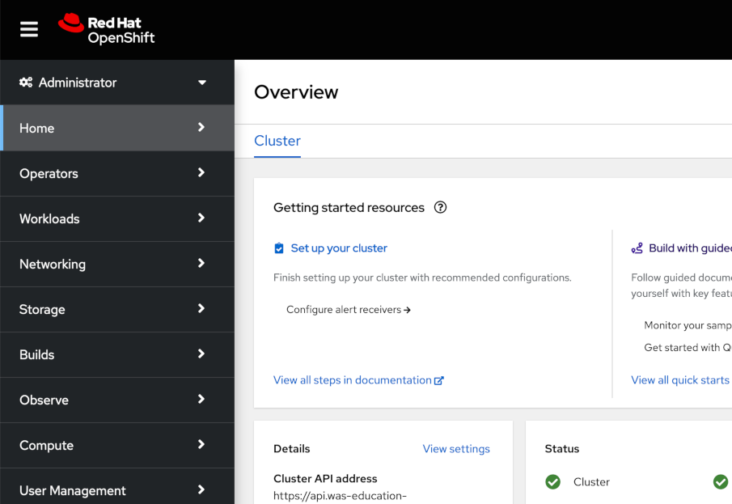
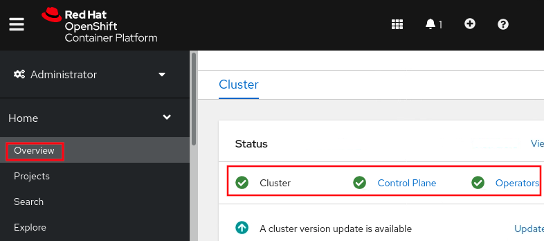
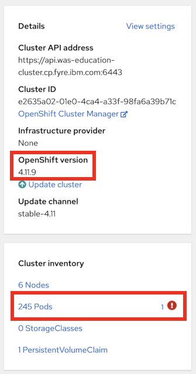
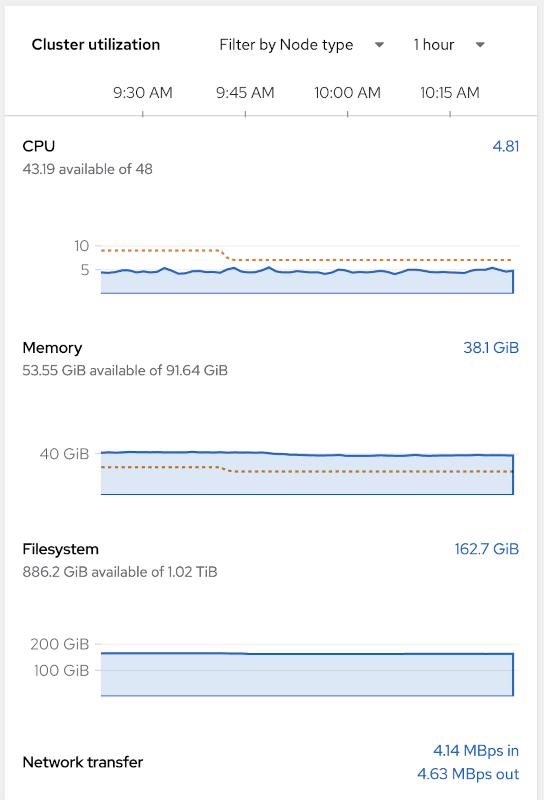
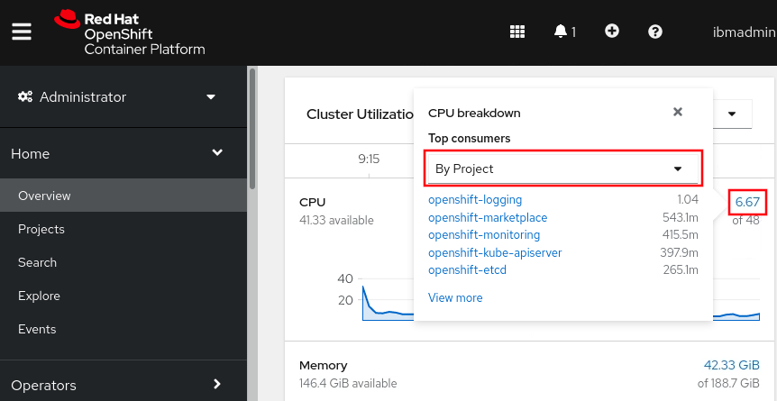
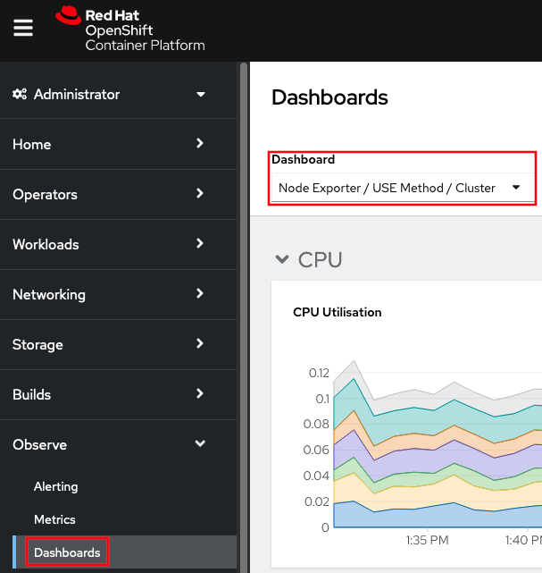
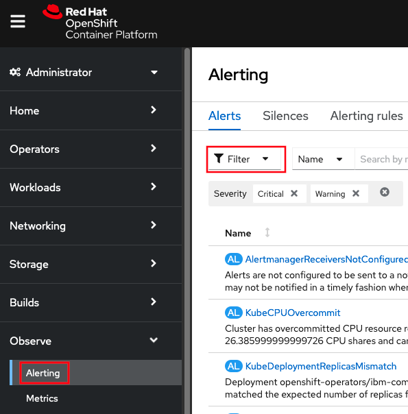
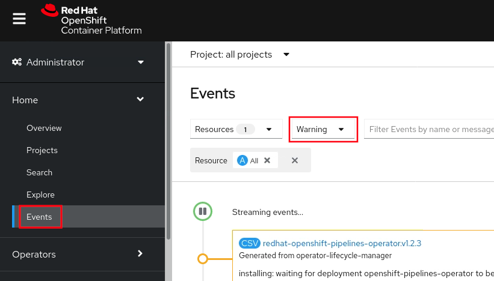

# Lab: General OpenShift Health

This lab covers how to check whether an OpenShift environment is generally healthy.

## Lab Requirements

1. This lab requires that the user has `cluster-admin` permissions. If you do not, you must skip this lab.

## Labs

Choose to perform the web console lab and/or the command line lab:

1. [Lab: Using the OpenShift Web Console to check cluster health](#lab-using-the-openshift-web-console-to-check-cluster-health)
1. [Lab: Using the command line to check cluster health](#lab-using-the-command-line-to-check-cluster-health)

-----

## Lab: Using the OpenShift Web Console to check cluster health

1. Access your OpenShift web console at `https://console-openshift-console.$CLUSTER/`. Replace `$CLUSTER` with your OpenShift cluster domain.
1. After logging in, you should see the Administrator view:  
   
1. On the main Overview page, scroll down to the `Status` box and ensure that `Cluster`, `Control Plane`, and `Operators` all show a green check mark. If they do not, there may be a fundamental issue with the cluster worth investigating. There may be a warning for `Insights` which is okay as it's not required. If there is an issue, clicking the hyperlink will show failure details.  
   
1. On the main Overview page, scroll down to the `Details` box and review the `OpenShift version`, and then scroll down to the `Cluster inventory` box and review the number of pods. If there are any known problematic pods, this will show a small exclamation icon and you can click the hyperlink for details on the failing pods.  
   
1. Next, scroll down to the `Cluster Utilization` box. You can change the time frame in the top right, and it's often useful to use `Filter by Node type` next to that to filter down to just worker or master nodes. Each section shows the total available (for example, `43.19 available of 48` means there are 48 total CPUs and 43.19 are available). Note that the graph y-axis is not scaled to the total available. The dashed yellow lines in the CPU and Memory sections are the sum of CPU and Memory pod requests (if specified) and it's normal for utilization to be above these lines. This may be due to pods using more than requests (up to specified limits) or requests/limits not being specified.  
     
   For each resource (e.g. CPU), click on the hyperlinked utilization number to get top consumers and switch to different groupings, e.g. `By Node` instead of `By Project`:  
   
1. If you want to investigate resources further, on the left side, click Observe (or Monitoring in older versions of OpenShift) } Dashboards } Then click the dropdown and select `Node Exporter / USE Method / Cluster`  
   
1. Next, review critical and warning alerts. On the left side, click Observe (or Monitoring in older versions of OpenShift) } Alerting } Then click `Filter`, and check `Critical` and `Warning`  
   
1. Next, review recent warning and error events: On the left side, click Home } Events } Then change `All types` to `Warning`  
   

### Summary

In summary, this lab demonstrated how to check basic OpenShift health including cluster health, resource utilization, alerts, and events.

Optionally, you may perform the next lab to get similar information through the command line.

-----

## Lab: Using the command line to check cluster health

1. Review the overall cluster status and check if the `STATUS` column has any errors.

        oc get clusterversion
   Example output:  
   
        NAME      VERSION   AVAILABLE   PROGRESSING   SINCE   STATUS
        version   4.11.9    True        False         39d     Cluster version is 4.11.9

1. Get the status of cluster operators.
   
        oc get clusteroperators
   Example output:
   
        NAME                       VERSION   AVAILABLE   PROGRESSING   DEGRADED   SINCE   MESSAGE
        authentication             4.11.9    True        False         False      3d6h    
   If any are `Degraded=True`, then run `oc describe clusteroperator $NAME`.

1. Review the status of nodes:

        oc get nodes                                                                        
   Example output:

        NAME                                            STATUS   ROLES    AGE   VERSION
        master0.was-education-cluster                   Ready    master   39d   v1.24.0+dc5a2fd
        master1.was-education-cluster                   Ready    master   39d   v1.24.0+dc5a2fd
        master2.was-education-cluster                   Ready    master   39d   v1.24.0+dc5a2fd
        worker0.was-education-cluster                   Ready    worker   39d   v1.24.0+dc5a2fd
        worker1.was-education-cluster                   Ready    worker   39d   v1.24.0+dc5a2fd
        worker2.was-education-cluster                   Ready    worker   39d   v1.24.0+dc5a2fd
   If any are `Status=NotReady`, then you could `oc describe node $NODE` and check the `Conditions` for errors.

1. Review node resource usage:

        oc adm top nodes
   Example output:

        NAME                                            CPU(cores)   CPU%   MEMORY(bytes)   MEMORY%   
        master0.was-education-cluster                   1002m        13%    10931Mi         75%       
        master1.was-education-cluster                   873m         11%    8603Mi          59%       
        master2.was-education-cluster                   1659m        22%    9231Mi          63%       
        worker0.was-education-cluster                   765m         10%    4146Mi          28%       
        worker1.was-education-cluster                   694m         9%     4009Mi          27%       
        worker2.was-education-cluster                   263m         3%     2868Mi          19%       

1. Review top pod CPU utilization.

        oc adm top pods --sort-by=cpu --all-namespaces
   Example output:

        NAMESPACE                   NAME                      CPU(cores)   MEMORY(bytes)   
        openshift-monitoring        prometheus-k8s-1          355m         1779Mi          
        [...]

1. Review top pod memory utilization:

        oc adm top pods --sort-by=memory --all-namespaces
   Example output:

        NAMESPACE                   NAME                                                            CPU(cores)   MEMORY(bytes)   
        openshift-kube-apiserver    kube-apiserver-master0.was-education-cluster                    318m         3137Mi          
        [...]

1. Review critical and warning alerts (on Windows, you'll need to install something like [Cygwin](https://www.cygwin.com/), etc.):
    1. Critical alerts:

            curl -k -H "Authorization: Bearer $(oc create token prometheus-k8s -n openshift-monitoring)" "https://$(oc -n openshift-monitoring get route alertmanager-main -o jsonpath='{.spec.host}')/api/v1/alerts?filter=severity=critical"

    1. Warning alerts:

            curl -k -H "Authorization: Bearer $(oc create token prometheus-k8s -n openshift-monitoring)" "https://$(oc -n openshift-monitoring get route alertmanager-main -o jsonpath='{.spec.host}')/api/v1/alerts?filter=severity=warning"

1. Review recent warning and error events. This is particularly useful to find if OpenShift is killing application pods for some reason, health check probes are failing, etc.

        oc get events --all-namespaces --sort-by='.lastTimestamp' --field-selector type=Warning -o custom-columns=FirstSeen:.firstTimestamp,LastSeen:.lastTimestamp,Count:.count,From:.source.component,Host:.source.host,Type:.type,Reason:.reason,ObjectKind:.involvedObject.kind,Object:.involvedObject.name,ObjectNamespace:.involvedObject.namespace,Message:.message

1. Check a node for kernel errors or warnings (e.g. OOM killer):
    1. List all the nodes:

            oc get nodes

    1. Take a node name and start a debug pod. For example:

            oc debug node/master0.was-education-cluster                 -t

    1. Wait for the `sh-4.4#` prompt.
    1. Print the kernel log with a filter for errors:

            chroot /host journalctl -p err | cat

    1. `exit`

1. List pods that have failed. It's okay if this output is blank and only shows output if there are active problems.

        oc get pods --all-namespaces --field-selector=status.phase==Failed
   Example output:

        NAMESPACE                              NAME                              READY   STATUS   RESTARTS   AGE
        openshift-operator-lifecycle-manager   collect-profiles-27859260-rxwq6   0/1     Error    0          29m

1. List pods in a pending state. It's okay if this output is blank and only shows output if there are active problems.

        oc get pods --all-namespaces --field-selector=status.phase==Pending
   Example output:

        No resources found

1. List pods in an unknown state. It's okay if this output is blank and only shows output if there are active problems.

        oc get pods --all-namespaces --field-selector=status.phase==Unknown
   Example output:

        No resources found

1. Check for pods with a high restart count. Even if they are in a Running state, a high restart count might indicate underlying problems. The following example shows those with a restart count greater than 3. On Windows, you'll need to install something like [Cygwin](https://www.cygwin.com/) with the `jq` utility. It's okay if this output is blank and only shows output if there are active problems.

        oc get pods --all-namespaces --field-selector=status.phase=Running -o json | jq '.items[]|select(any( .status.containerStatuses[]; .restartCount > 3))|.metadata.name'

### Summary

In summary, this lab demonstrated how to check basic OpenShift health including cluster health, resource utilization, alerts, and events.
