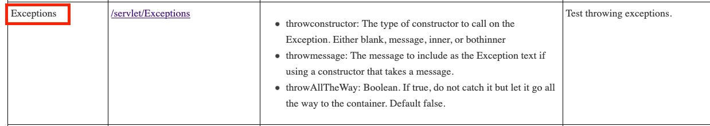
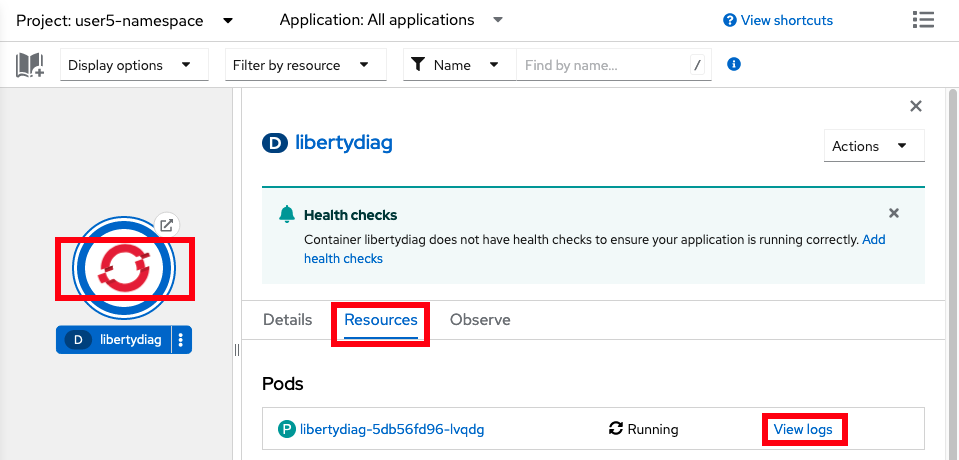
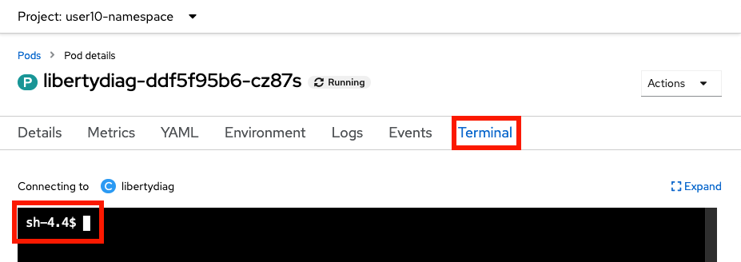

# Lab: Application Errors or Warnings

This lab covers how to investigate application errors or warnings in Liberty applications in OpenShift.

-----

## Lab

This lab will take approximately 5 minutes.

### Step 1: Install example application

If you haven't already, [install the sample application](lab_liberty_install_app.md). If you installed it in a previous lab, you may continue using the previous installation.

### Step 2: Exercise error servlet

Now you will use the libertydiag application to simulate errors. 

Using the command line

1. Request the following web page from your terminal to simulate errors:
    1. macOS, Linux, or Windows with Cygwin:

            curl -k -s "https://$(oc get route libertydiag "--output=jsonpath={.spec.host}")/servlet/Exceptions"

    1. Windows with Command Prompt:
        1. Ensure you have [`curl` for Windows](https://curl.se/windows/) installed
        1. List the application's URL:

                oc get route libertydiag "--output=jsonpath={.spec.host}{'\n'}"

        1. Execute the following command, replacing `$HOST` with the output of the previous command:

                curl -k -s "https://$HOST/servlet/Exceptions"

1. You should see an exception stack trace. If not, rerun the `curl` command with the `-v` option to investigate. 
1. Request the following web page from your terminal with additional parameters:
    1. macOS, Linux, or Windows with Cygwin:

            curl -k -s "https://$(oc get route libertydiag "--output=jsonpath={.spec.host}")/servlet/Exceptions?throwAllTheWay=true&throwmessage=errorEncountered&throwconstructor=message"

    1. Windows with Command Prompt:
        1. Ensure you have [`curl` for Windows](https://curl.se/windows/) installed
        1. List the application's URL:

                oc get route libertydiag "--output=jsonpath={.spec.host}{'\n'}"

        1. Execute the following command, replacing `$HOST` with the output of the previous command:

                curl -k -s "https://$HOST/servlet/Exceptions?throwAllTheWay=true&throwmessage=errorEncountered&throwconstructor=message"

Using the browser

1. Click on the `Exceptions` link from the libertydiag application homepage:  
   
1. You should see an exception stack trace in the browser. Now add the query parameters `throwAllTheWay=true&throwmessage=errorEncountered` to the end of the URL and press `ENTER`:

        [...]/servlet/Exceptions?throwAllTheWay=true&throwmessage=errorEncountered&throwconstructor=message

1. You should see a different error page with an Error 500. Reload the page a couple of times. 

### Step 3: Review log data

Now you will review the logs to understand how to investigate exceptions. 

Using the command line

1. List the pods for the example application deployment; for example:

        oc get pods
   Example output:

        NAME                          READY   STATUS    RESTARTS   AGE
        libertydiag-b98748954-mgj64   1/1     Running   0          97s

1. Print the native logs of the pod by replacing `$POD` with the pod name from the previous command. The native logs are equivalent to the Liberty `console.log` in a non-cloud deployment.

        oc logs $POD
   For example:

        oc logs libertydiag-b98748954-mgj64

1. The native logs are a bit hard to review since they're in JSON, so next we'll review the `messages.log`.
1. Open a shell into the pod by replacing `$POD` with a pod name from the previous command:

        oc rsh -t $POD
   For example:

        oc rsh -t libertydiag-b98748954-mgj64

1. Copy and paste the following command and press `Enter` to print the full Liberty `messages.log`:

        cat /logs/messages.log

1. You should see an application exception in the logs such as:

        [1/11/23 20:01:10:780 UTC] 00000028 com.ibm.ws.webcontainer.util.ApplicationErrorUtils           E SRVE0777E: Exception thrown by application class 'com.example.servlet.Exceptions.doWork:50'
        com.example.util.SkipCatchException: errorEncountered
	       at com.example.servlet.Exceptions.doWork(Exceptions.java:50)
	       at com.example.util.BaseServlet.service(BaseServlet.java:104) [...]

Using the browser

1. In the `Topology` view of the [`Developer` perspective](openshift_perspective.md), click on the `libertydiag` circle, then click the `Resources` tab in the drawer on the right, and then click on `View logs` for the one pod that's running. The `View logs` output is equivalent to the Liberty `console.log` in a non-cloud deployment.  
   
1. Click on the `Terminal` tab to open a remote shell into the running container in the pod:  
   
1. Copy and paste the following command and press `Enter` to print the full Liberty `messages.log`:

        cat /logs/messages.log

1. You should see an application exception in the logs such as:

        [1/11/23 20:01:10:780 UTC] 00000028 com.ibm.ws.webcontainer.util.ApplicationErrorUtils           E SRVE0777E: Exception thrown by application class 'com.example.servlet.Exceptions.doWork:50'
        com.example.util.SkipCatchException: errorEncountered
	       at com.example.servlet.Exceptions.doWork(Exceptions.java:50)
	       at com.example.util.BaseServlet.service(BaseServlet.java:104) [...]

### Step 4: Download Liberty logs

In many cases, you may want the full logs for review on your workstation.

Using the command line

1. List the pods for the example application deployment; for example:

        oc get pods
   Example output:

        NAME                          READY   STATUS    RESTARTS   AGE
        libertydiag-ddf5f95b6-wj6dm   1/1     Running   0          97s

1. Download the Liberty `messages.log` by replacing `$POD` with a pod name from the previous command

        oc cp $POD:/logs/messages.log messages.log
   For example:

        oc cp libertydiag-ddf5f95b6-wj6dm:/logs/messages.log messages.log

Using the browser

Files other than native logs (equivalent to Liberty's `console.log`) cannot be downloaded through the browser. You must use the command line steps above. Alternatively, you may use the `Terminal` tab of the pod and `cat` the file in the browser.

### Summary

In summary, this lab demonstrated how to view Liberty logs in an OpenShift environment to investigate exceptions. 
