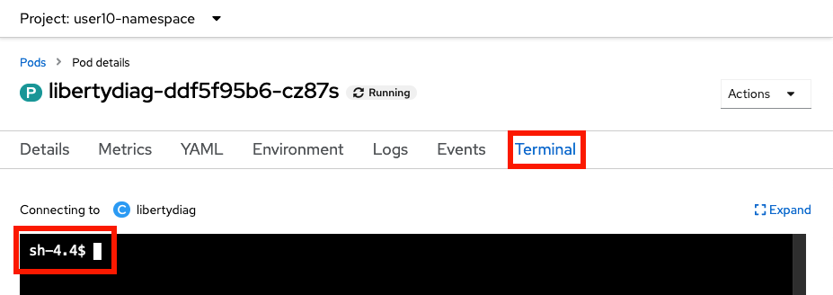

# Lab: Reviewing OpenShift Application Logs

This lab covers how to review application logs in an OpenShift environment. 

## Theory

There are multiple ways to review application logs in an OpenShift environment:

1. Using the `oc` command line client:
    1. View the native logs of the pod through the `oc logs` command.
    1. View log files within a pod by starting a remote shell using the `oc rsh` command.
    1. Download log files from a pod using the `oc cp` command.
1. Using the OpenShift web console:
    1. View and/or download the native logs of the pod through the `Logs` tab on a pod.
    1. View log files within a pod through the `Terminal` tab on a pod.
1. Publish native logs of pods to [OpenShift centralized logging](https://docs.openshift.com/container-platform/latest/logging/cluster-logging-deploying.html) using, most commonly, [EFK](https://github.com/OpenLiberty/open-liberty-operator/blob/main/doc/observability-deployment.adoc#how-to-analyze-open-liberty-logs), and then search logs in the Kibana log viewer. Optionally install [sample Kibana dashboards](https://github.com/WASdev/sample.dashboards) created by the WebSphere team that summarize application log events and statistics.
1. Gather a Liberty server dump using the WebSphere Liberty Operator that includes Liberty log files.

-----

## Lab: Review logs with the command line client or the OpenShift web console pod page

This lab will demonstrate how to review both application native logs (equivalent to the Liberty `console.log`) and the Liberty `messages.log` using the `oc` command line client or the OpenShift web console pod page.

This lab will take approximately 15 minutes.

### Step 1: Install example application

[Install the sample application](lab_liberty_install_app.md).

### Step 2: Review Application Logs

<details markdown="1">
<summary>Using the command line</summary>

1. List the pods for the example application deployment; for example:

        oc get pods
   Example output:

        NAME                          READY   STATUS    RESTARTS   AGE
        libertydiag-b98748954-mgj64   1/1     Running   0          97s

1. Print the native logs of the pod by replacing `$POD` with the pod name from the previous command. The native logs are equivalent to the Liberty `console.log` in a non-cloud deployment.

        oc logs $POD
   For example:

        oc logs libertydiag-b98748954-mgj64

1. Open a shell into the pod by replacing `$POD` with the pod name from the previous command:

        oc rsh -t $POD
   For example:

        oc rsh -t libertydiag-b98748954-mgj64

1. Copy and paste the following command and press `Enter` to print the full Liberty `messages.log`:

        cat /logs/messages.log

1. Alternatively, if you want to download a file to your computer, exit out of the `rsh` session and download `messages.log` by replacing `$POD` with the pod name from the previous command:

        oc cp $POD:/logs/messages.log messages.log
   For example:

        oc cp libertydiag-b98748954-mgj64:/logs/messages.log messages.log

</details>

<details markdown="1">
<summary>Using the browser</summary>

1. In the `Topology` view of the [`Developer` perspective](openshift_perspective.md), click on the `libertydiag` circle, then click the `Resources` tab in the drawer on the right, and then click on `View logs` for the one pod that's running. The `View logs` output is equivalent to the Liberty `console.log` in a non-cloud deployment.  
   
1. You can also download the native logs using the Download button:  
   
1. Note that the browser can only download native logs; it cannot download arbitrary logs from the container filesystem. Instead, you can `cat` the logs through the `Terminal`.
1. Click on the `Terminal` tab to open a remote shell into the running container in the pod:  
   
1. Copy and paste the following command and press `Enter` to print the full Liberty `messages.log`:
   ```
   cat /logs/messages.log
   ```

</details>

### Summary

In summary, this lab demonstrated how to install a sample application and review its logs.
