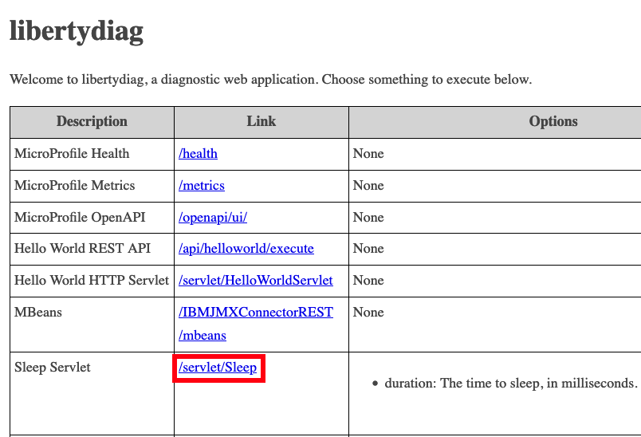

# Lab: Diagnostic Trace

This lab covers how to enable and review diagnostic trace for a sample Liberty application in OpenShift.

## Theory

There are multiple ways to enable diagnostic trace in Liberty in an OpenShift environment:

1. Add a `<logging traceSpecification=... />` section to `server.xml` or add a configuration drop-in. This only works if [runtime configuration updates](https://www.ibm.com/docs/en/was-liberty/base?topic=manually-controlling-dynamic-updates) are enabled, as they are by default.
1. If the application is installed using the WebSphere Liberty Operator, the [WebSphereLibertyTrace custom resource](https://www.ibm.com/docs/en/was-liberty/base?topic=resources-webspherelibertytrace-custom-resource) may be used to enable and disable trace. This only works if [runtime configuration updates](https://www.ibm.com/docs/en/was-liberty/base?topic=manually-controlling-dynamic-updates) are enabled, as they are by default, if the `WebSphereLibertyApplication` custom resource has the proper [`openliberty.io/day2operations` annotation](https://www.ibm.com/docs/en/was-liberty/base?topic=resources-webspherelibertytrace-custom-resource), and if the container has a [`/serviceability` directory](https://www.ibm.com/docs/en/was-liberty/base?topic=operator-storage-serviceability).
1. An application image may be re-built and re-deployed with an additional `<logging traceSpecification=... />` section in `server.xml` or using a configuration drop-in.

There are various well-known [diagnostic trace specifications for WebSphere Liberty](https://www.ibm.com/support/pages/set-trace-and-get-full-dump-websphere-liberty).

## Labs

Choose one or more labs:

1. [Lab: HTTP Diagnostic Trace by adding a configuration dropin](#lab-http-diagnostic-trace-by-adding-a-configuration-dropin)
1. [Lab: HTTP Diagnostic Trace through the WebSphere Liberty Operator](#lab-http-diagnostic-trace-through-the-websphere-liberty-operator)

-----

## Lab: HTTP Diagnostic Trace by adding a configuration dropin

This lab will enable HTTP diagnostic trace by adding a configuration dropin with a trace specification.

This lab will take approximately 10 minutes.

### Step 1: Install example application

If you haven't already, [install the sample application](lab_liberty_install_app.md). If you installed it in a previous lab, you may continue using the previous installation.

### Step 2: Configure diagnostic trace

Now that the application is installed and running, you will configure diagnostic trace. You will be modifying a running pod. In some real-world cases, this may be infeasible and the image will need to be re-built and re-deployed with the updated configuration.

<details markdown="1">
<summary>Using the command line</summary>

1. List the pods for the example application deployment; for example:

        oc get pods
   Example output:

        NAME                          READY   STATUS    RESTARTS   AGE
        libertydiag-b98748954-mgj64   1/1     Running   0          97s

1. Open a shell into the pod by replacing `$POD` with a pod name from the previous command:

        oc rsh -t $POD
   For example:

        oc rsh -t libertydiag-b98748954-mgj64

1. Copy and paste the following command and press `Enter`. Liberty will dynamically update the diagnostic trace configuration in the server.

```
echo '<?xml version="1.0" encoding="UTF-8"?><server><logging traceSpecification="*=info:com.ibm.ws.webcontainer*=all:com.ibm.wsspi.webcontainer*=all:HTTPChannel=all:GenericBNF=all:HTTPDispatcher=all" maxFileSize="100" maxFiles="10" /></server>' > /config/configDropins/overrides/trace.xml
```

</details>

<details markdown="1">
<summary>Using the browser</summary>

1. In the `Topology` view of the [`Developer` perspective](openshift_perspective.md), click on the `libertydiag` circle, then click the `Resources` tab in the drawer on the right, and then click on the one pod that's running:  
   
1. Click on the `Terminal` tab to open a remote shell into the running container in the pod:  
   
1. Copy and paste the following command and press `Enter`. Liberty will dynamically update the diagnostic trace configuration in the server.

```
echo '<?xml version="1.0" encoding="UTF-8"?><server><logging traceSpecification="*=info:com.ibm.ws.webcontainer*=all:com.ibm.wsspi.webcontainer*=all:HTTPChannel=all:GenericBNF=all:HTTPDispatcher=all" maxFileSize="100" maxFiles="10" /></server>' > /config/configDropins/overrides/trace.xml
```

</details>

### Step 3: Exercise an HTTP request

Now that HTTP diagnostic trace is configured, you will simulate an HTTP request to Liberty.

<details markdown="1">
<summary>Using the command line</summary>

1. Request the following web page from your terminal to simulate an HTTP request:
    1. macOS, Linux, or Windows with Cygwin:  

            curl -k -s "https://$(oc get route libertydiag "--output=jsonpath={.spec.host}")/servlet/Sleep"

    1. Windows with Command Prompt:
        1. Ensure you have [`curl` for Windows](https://curl.se/windows/) installed
        1. List the application's URL:

                oc get route libertydiag "--output=jsonpath={.spec.host}{'\n'}"

        1. Execute the following command, replacing `$HOST` with the output of the previous command:

                curl -k -s "https://$HOST/servlet/Sleep"

</details>

<details markdown="1">
<summary>Using the browser</summary>

1. Click on the `/servlet/Sleep` link from the libertydiag application homepage:  
   

</details>

### Step 4: Disable diagnostic trace

Now that the diagnostic trace has been captured, you will learn how to disable the diagnostic trace.

<details markdown="1">
<summary>Using the command line</summary>

1. List the pods for the example application deployment; for example:

        oc get pods
   Example output:

        NAME                          READY   STATUS    RESTARTS   AGE
        libertydiag-b98748954-mgj64   1/1     Running   0          97s

1. Open a shell into the pod by replacing `$POD` with a pod name from the previous command:

        oc rsh -t $POD
   For example:

        oc rsh -t libertydiag-b98748954-mgj64

1. Copy and paste the following command and press `Enter`. Liberty will dynamically update the diagnostic trace configuration in the server back to its original value.

        rm /config/configDropins/overrides/trace.xml

</details>

<details markdown="1">
<summary>Using the browser</summary>

1. In the `Topology` view of the [`Developer` perspective](openshift_perspective.md), click on the `libertydiag` circle, then click the `Resources` tab in the drawer on the right, and then click on the one pod that's running:  
   
1. Click on the `Terminal` tab to open a remote shell into the running container in the pod:  
   
1. Copy and paste the following command and press `Enter`. Liberty will dynamically update the diagnostic trace configuration in the server back to its original value.

        rm /config/configDropins/overrides/trace.xml

</details>

### Step 5: Download trace logs

Download trace logs to your workstation.

<details markdown="1">
<summary>Using the command line</summary>

1. List the pods for the example application deployment; for example:

        oc get pods
   Example output:

        NAME                          READY   STATUS    RESTARTS   AGE
        libertydiag-ddf5f95b6-wj6dm   1/1     Running   0          97s

1. Download the logs by replacing `$POD` with a pod name from above. Note that `oc cp` does not support wildcards so the whole directory (or a single file) must be downloaded.

        oc cp $POD:/logs .
   For example:

        oc cp libertydiag-ddf5f95b6-wj6dm:/logs .

1. You should be able to find the `Sleep` request executed above; for example:

        [1/3/23 16:48:19:462 UTC] 0000006d id=00000000 com.ibm.ws.webcontainer.servlet.ServletWrapper               > handleRequest ServletWrapper[com.example.servlet.Sleep:[/servlet/Sleep]] ,request-> com.ibm.ws.webcontainer40.srt.SRTServletRequest40@20a8494e ,response-> com.ibm.ws.webcontainer40.srt.SRTServletResponse40@86c16c72 ENTRY
        
        [1/3/23 16:48:19:473 UTC] 0000006d id=00000000 com.example.util.BaseServlet                                 I libertydiag: Invoking com.example.servlet.Sleep by anonymous (10.254.20.1)... []
        
        [1/3/23 16:48:20:482 UTC] 0000006d id=00000000 com.example.util.BaseServlet                                 I libertydiag: Done com.example.servlet.Sleep
     
        [1/3/23 16:48:20:495 UTC] 0000006d id=7d221183 com.ibm.ws.webcontainer.osgi.DynamicVirtualHost              3 Webcontainer handleRequest complete for--> [/servlet/Sleep], mapped webApp context [com.ibm.ws.webcontainer40.osgi.webapp.WebApp40@35a6e71f[libertydiag#libertydiag.war]], inboundConnection --> [com.ibm.ws.http.dispatcher.internal.channel.HttpDispatcherLink@22dbf0bd], this --> com.ibm.ws.webcontainer.osgi.DynamicVirtualHost$2@7d221183

</details>

<details markdown="1">
<summary>Using the browser</summary>

Files other than native logs (equivalent to Liberty's `console.log`) cannot be downloaded through the browser. You must use the command line steps above. Alternatively, you may use the `Terminal` tab of the pod and `cat` the file in the browser.

</details>

### Summary

In summary, this lab demonstrated how to configure HTTP diagnostic trace in Liberty, exercise a request, and download the trace logs.

-----

## Lab: HTTP Diagnostic Trace through the WebSphere Liberty Operator

This lab will enable HTTP diagnostic trace using the WebSphere Liberty Operator with an example application and review the output.

This lab will take approximately 10 minutes.

### Step 1: Install example application

If you haven't already, [install the sample application](lab_liberty_install_app.md) using the WebSphere Liberty operator. If you installed it in a previous lab, you may continue using the previous installation. If you previously installed the sample using a basic Kubernetes deployment, then [uninstall it](lab_liberty_uninstall_app.md) and [re-install](lab_liberty_install_app.md) using the WebSphere Liberty operator.

### Step 2: Configure diagnostic trace

Now that the application is installed and running, you will configure diagnostic trace using the [WebSphere Liberty Operator trace custom resource](https://www.ibm.com/docs/en/was-liberty/base?topic=resources-webspherelibertytrace-custom-resource).

<details markdown="1">
<summary>Using the command line</summary>

1. List the pods for the example application deployment; for example:

        oc get pods
   Example output:

        NAME                          READY   STATUS    RESTARTS   AGE
        libertydiag-b98748954-mgj64   1/1     Running   0          97s

1. Create a `trace.yaml` file, replacing `$POD` with the name of the pod from the previous command (e.g. `libertydiag-b98748954-mgj64`):

        apiVersion: liberty.websphere.ibm.com/v1
        kind: WebSphereLibertyTrace
        metadata:
          name: libertytrace1
          annotations:
            day2operation.openliberty.io/targetKinds: Pod
        spec:
          license:
            accept: true
          podName: $POD
          traceSpecification: "*=info:com.ibm.ws.webcontainer*=all:com.ibm.wsspi.webcontainer*=all:HTTPChannel=all:GenericBNF=all:HTTPDispatcher=all"
          maxFileSize: 100
          maxFiles: 5
          disable: false

1. Apply the YAML:

        oc apply -f trace.yaml

</details>

<details markdown="1">
<summary>Using the browser</summary>

1. Ensure the perspective is set to `Developer` in the top left:  
   
1. Set your current namespace/project to what you were provided. For example:  
   
1. In the `Topology` view of the [`Developer` perspective](openshift_perspective.md), click on the `libertydiag` circle, then click the `Resources` tab in the drawer on the right, and then copy the name of the pod that's running:  
   
1. Click `Operator Backed` on the `+Add` page:  
   
1. Click `WebSphereLibertyTrace` and then click `Create`
1. Expand `License` and check `accept`
1. Paste the pod name from the step above into the `podName` text box.
1. Set the `traceSpecification` to:

        *=info:com.ibm.ws.webcontainer*=all:com.ibm.wsspi.webcontainer*=all:HTTPChannel=all:GenericBNF=all:HTTPDispatcher=all

1. Set `maxFileSize` to `100`
1. Click `Create`

</details>

### Step 3: Exercise an HTTP request

Now that HTTP diagnostic trace is configured, you will simulate an HTTP request to Liberty.

<details markdown="1">
<summary>Using the command line</summary>

1. Request the following web page from your terminal to simulate an HTTP request:
    1. macOS, Linux, or Windows with Cygwin:

            curl -k -s "https://$(oc get route libertydiag "--output=jsonpath={.spec.host}")/servlet/Sleep"

    1. Windows with Command Prompt:
        1. Ensure you have [`curl` for Windows](https://curl.se/windows/) installed
        1. List the application's URL:

                oc get route libertydiag "--output=jsonpath={.spec.host}{'\n'}"

        1. Execute the following command, replacing `$HOST` with the output of the previous command:

                curl -k -s "https://$HOST/servlet/Sleep"

</details>

<details markdown="1">
<summary>Using the browser</summary>

1. Click on the `/servlet/Sleep` link from the libertydiag application homepage:  
   

</details>

### Step 4: Disable diagnostic trace

Now that the diagnostic trace has been captured, you will learn how to disable the diagnostic trace.

<details markdown="1">
<summary>Using the command line</summary>

1. List `WebSphereLibertyTrace` custom resources; for example:

        oc get wltrace
   Example output:

        NAME            PODNAME                      TRACING
        libertytrace1   libertydiag-5fdf699f-sfwqn   True

1. Delete the custom resource you created earlier; for example:

        oc delete wltrace libertytrace1

</details>

<details markdown="1">
<summary>Using the browser</summary>

1. Click on `Search`, click the `Resources` drop down, search for `trace`, check `WebSphereLibertyTrace`, click the vertical ellipses next to the custom resource created earlier, click `Delete WebSphereLibertyTrace`, and click `Delete`:  
   


</details>

### Step 5: Download trace logs

Download trace logs to your workstation.

<details markdown="1">
<summary>Using the command line</summary>

1. List the pods for the example application deployment; for example:

        oc get pods
   Example output:

        NAME                          READY   STATUS    RESTARTS   AGE
        libertydiag-ddf5f95b6-wj6dm   1/1     Running   0          97s

1. Download the logs by replacing `$POD` with a pod name from above and `$NAMESPACE` with your namespace. Note that `oc cp` does not support wildcards so the whole directory (or a single file) must be downloaded.

        oc cp $POD:/serviceability/$NAMESPACE/$POD/ .
   For example:

        oc cp libertydiag-ddf5f95b6-wj6dm:/serviceability/user15-namespace/libertydiag-ddf5f95b6-wj6dm/ .

1. You should be able to find the `Sleep` request executed above; for example:

        [1/3/23 16:48:19:462 UTC] 0000006d id=00000000 com.ibm.ws.webcontainer.servlet.ServletWrapper               > handleRequest ServletWrapper[com.example.servlet.Sleep:[/servlet/Sleep]] ,request-> com.ibm.ws.webcontainer40.srt.SRTServletRequest40@20a8494e ,response-> com.ibm.ws.webcontainer40.srt.SRTServletResponse40@86c16c72 ENTRY
        
        [1/3/23 16:48:19:473 UTC] 0000006d id=00000000 com.example.util.BaseServlet                                 I libertydiag: Invoking com.example.servlet.Sleep by anonymous (10.254.20.1)... []
        
        [1/3/23 16:48:20:482 UTC] 0000006d id=00000000 com.example.util.BaseServlet                                 I libertydiag: Done com.example.servlet.Sleep
     
        [1/3/23 16:48:20:495 UTC] 0000006d id=7d221183 com.ibm.ws.webcontainer.osgi.DynamicVirtualHost              3 Webcontainer handleRequest complete for--> [/servlet/Sleep], mapped webApp context [com.ibm.ws.webcontainer40.osgi.webapp.WebApp40@35a6e71f[libertydiag#libertydiag.war]], inboundConnection --> [com.ibm.ws.http.dispatcher.internal.channel.HttpDispatcherLink@22dbf0bd], this --> com.ibm.ws.webcontainer.osgi.DynamicVirtualHost$2@7d221183

</details>

<details markdown="1">
<summary>Using the browser</summary>

Files other than native logs (equivalent to Liberty's `console.log`) cannot be downloaded through the browser. You must use the command line steps above. Alternatively, you may use the `Terminal` tab of the pod and `cat` the file in the browser.

</details>

### Summary

In summary, this lab demonstrated how to configure HTTP diagnostic trace in Liberty using the WebSphere Liberty Operator, exercise a request, and download the trace logs.
