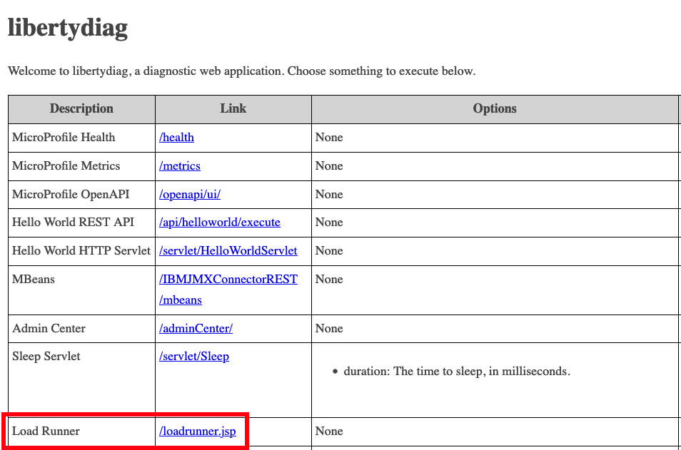
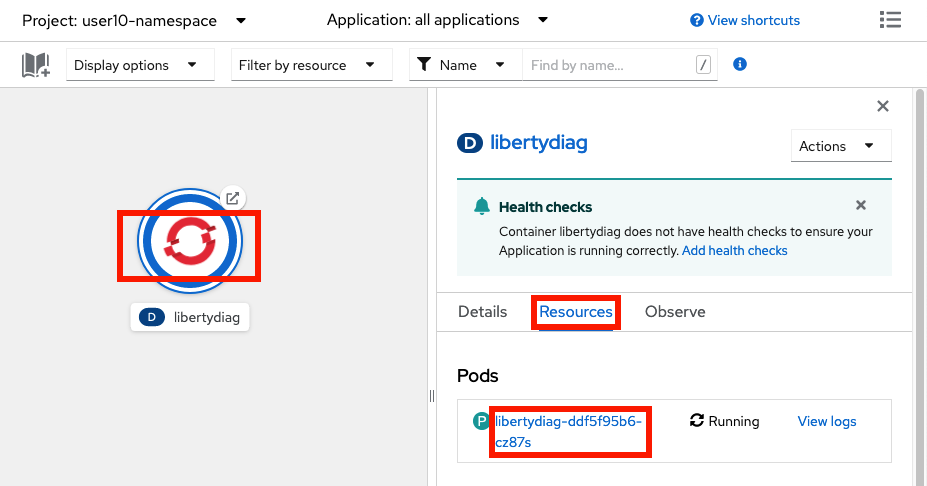
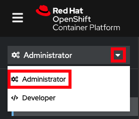
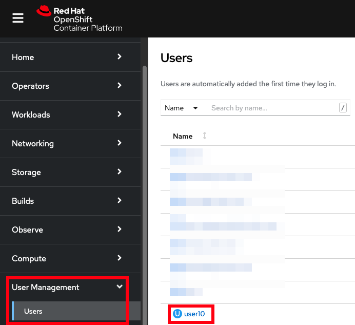
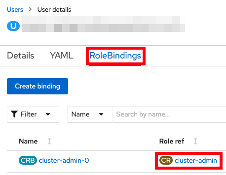

# Lab: High CPU

This lab covers how to investigate high CPU for a sample Liberty application in OpenShift.

## Theory

There are many ways to review high CPU for Liberty in an OpenShift environment:

1. Review verbose garbage collection during the issue to check for a high proportion of time in garbage collection
1. Manually gather thread dumps during the issue by opening a terminal in the container and executing `kill -3 $PID`
1. If the application is installed using the WebSphere Liberty Operator, the [WebSphereLibertyDump custom resource](https://www.ibm.com/docs/en/was-liberty/base?topic=resources-webspherelibertydump-custom-resource) may be used to gather a [Liberty server dump](https://openliberty.io/docs/latest/reference/command/server-dump.html) with a thread dump. This only works if the `WebSphereLibertyApplication` custom resource has the proper [`openliberty.io/day2operations` annotation](https://www.ibm.com/docs/en/was-liberty/base?topic=resources-webspherelibertydump-custom-resource), and if the container has a [`/serviceability` directory](https://www.ibm.com/docs/en/was-liberty/base?topic=operator-storage-serviceability).
1. If you have `cluster-admin` permissions, use the [MustGather: Performance, hang, or high CPU issues with WebSphere Application Server on Linux on Containers](https://www.ibm.com/support/pages/mustgather-performance-hang-or-high-cpu-issues-websphere-application-server-linux-containers) during the issue and search for repeating patterns in thread dumps
1. If running IBM Java 8, gather a headless mode HealthCenter Java sampling profiler collection
1. If you have `cluster-admin` permissions, gather a Linux `perf` native sampling profiler collection
1. Run `top -H` to review per-thread CPU utilization, if the container image includes the `top` utility
1. Use third-party monitoring products such as [Instana](https://www.instana.com/supported-technologies/websphere-liberty/)

This lab will only cover some of the above methods.

## Labs

Choose one or more labs:

1. [Lab: Manually gather thread dumps during the issue](#lab-manually-gather-thread-dumps-during-the-issue)
1. [Lab: Use the performance/hang/high CPU MustGather on Linux on Containers](#lab-use-the-performancehanghigh-cpu-mustgather-on-linux-on-containers)
1. You could also gather a `server dump` as done in the [High response times lab](lab_liberty_high_http_response_times.md#lab-gather-a-liberty-server-dump-through-the-websphere-liberty-operator)

-----

## Lab: Manually gather thread dumps during the issue

This lab will gather thread dumps showing accumulated CPU by thread and associated stacks. Any statistical patterns in thread stacks associated with high CPU threads may be used to infer potential causes of high CPU.

This method is generally used when there is persistently high CPU. If CPU spikes are infrequent, then this technique is more difficult unless you capture a lot of thread dumps.

This lab will take approximately 10 minutes.

### Step 1: Install example application

If you haven't already, [install the sample application](lab_liberty_install_app.md). If you installed it in a previous lab, you may continue using the previous installation.

### Step 2: Exercise high CPU

You will simulate 5 concurrent users sending HTTP requests that perform CPU intensive operations such as compiling regular expressions and performing mathematical operations.

Using the command line

1. Request the following web page from your terminal to exercise high CPU:
    1. macOS, Linux, or Windows with Cygwin:

            curl -k -s "https://$(oc get route libertydiag "--output=jsonpath={.spec.host}")/servlet/LoadRunner?url=http%3A%2F%2Flocalhost%3A9080%2Fservlet%2FDoComplicatedStuff%3Fmoreiterations%3Dtrue&method=get&entity=&concurrentusers=5&totalrequests=0&user=&password=&infinite=on"

    1. Windows with Command Prompt:
        1. Ensure you have [`curl` for Windows](https://curl.se/windows/) installed
        1. List the application's URL:

                oc get route libertydiag "--output=jsonpath={.spec.host}{'\n'}"

        1. Execute the following command, replacing `$HOST` with the output of the previous command:

                curl -k -s "https://$HOST/servlet/LoadRunner?url=http%3A%2F%2Flocalhost%3A9080%2Fservlet%2FDoComplicatedStuff%3Fmoreiterations%3Dtrue&method=get&entity=&concurrentusers=5&totalrequests=0&user=&password=&infinite=on"

1. This load will run indefinitely. Continue to the next step.

Using the browser

1. Click on the `Load Runner` link from the libertydiag application homepage:  
   
1. In the `Target URL`, copy and paste the following:

        http://localhost:9080/servlet/DoComplicatedStuff?moreiterations=true

1. Scroll down and check `Infinite (until manually stopped)`
1. Scroll to the bottom and click `Start`
1. This load will run indefinitely. Continue to the next step.

### Step 3: Manually gather thread dumps

Now you will gather a number of thread dumps.

Using the command line

1. List the pods for the example application deployment; for example:

        oc get pods
   Example output:

        NAME                          READY   STATUS    RESTARTS   AGE
        libertydiag-b98748954-mgj64   1/1     Running   0          97s

1. Open a shell into the pod by replacing `$POD` with a pod name from the previous command:

        oc rsh -t $POD
   For example:

        oc rsh -t libertydiag-b98748954-mgj64

1. Note that the remote shell might timeout after a short period of inactivity, so be aware that you might have been logged out and you'll need to `oc rsh` back in to continue where you left off.
1. First, we need to find the process ID (PID) of Liberty. Most Liberty images do not have tools like `ps` or `top` pre-installed. However, most Liberty images only have a single process in the container which is the Java process running Liberty, and this has the PID of 1. Double check that this is the Liberty process by doing a full listing on PID 1:

        ls -l /proc/1/

1. If you see a Liberty current working directory (`cwd`) such as `/opt/ol/wlp` or `/opt/ibm/wlp` then you can assume that is the Liberty process. Otherwise, run `ls -l /proc/[0-9]*` and then explore each PID to find the Liberty process.

        ls -l /proc/1
   Example output:

        [...]
        lrwxrwxrwx.  1 1000830000 root 0 Dec  6 17:45 cwd -> /opt/ibm/wlp/output/defaultServer
        -r--------.  1 1000830000 root 0 Dec  6 17:45 environ
        lrwxrwxrwx.  1 1000830000 root 0 Dec  6 14:57 exe -> /opt/ibm/java/jre/bin/java
        [...]

1. Create a thread dump by sending the `SIGQUIT` signal to the process using the `kill -QUIT $PID` command. Replace `$PID` with the process ID of Liberty that you found above. Note that, by default, Java handles the `SIGQUIT` signal, creates the thread dump, and the process continues, so the process is not killed, despite the names of the command and signal.

        kill -QUIT 1

1. It's common to wait about 30 seconds between thread dumps. Take another 1 or more thread dumps, waiting some time in between.

        kill -QUIT 1

1. Normally, thread dumps for IBM Java and Semeru will be produced as `javacore*txt` files in the `cwd` directory that you found above:

        ls -l /opt/ibm/wlp/output/defaultServer/javacore*txt
   However, in the case of this sample application, this directory is overridden with an `-Xdump` configuration. You can check JVM configurations by printing the process `cmdline` and `environ` files and find the relevant configuration. For example:

        cat /proc/1/cmdline /proc/1/environ
   Example output:

        [...] -Xdump:directory=logs/diagnostics/
   Therefore, for this application, javacores will go into `logs/diagnostics/` relative to `cwd`:

        ls /opt/ibm/wlp/output/defaultServer/logs/diagnostics/javacore*txt
   Example output:

        /opt/ibm/wlp/output/defaultServer/logs/diagnostics/javacore.20221206.175535.1.0001.txt
        /opt/ibm/wlp/output/defaultServer/logs/diagnostics/javacore.20221206.175626.1.0002.txt
   Note that overridding the `-Xdump` directory is common in container deployments so that a directory may be used that's mounted on a permanent disk so that diagnostics are still available if a pod is killed.

Using the browser

1. In the `Topology` view of the [`Developer` perspective](openshift_perspective.md), click on the `libertydiag` circle, then click the `Resources` tab in the drawer on the right, and then click on the one pod that's running:  
   
1. Click on the `Terminal` tab to open a remote shell into the running container in the pod:  
   
1. Follow the `Using the command line` steps above starting at step 4.

### Step 4: Download thread dumps

Using the command line

1. Download the thread dumps by replacing `$POD` with a pod name from above and `$DIR` with the directory of the javacores. Note that `oc cp` does not support wildcards so the whole directory (or a single file) must be downloaded.

        oc cp $POD:$DIR .
   For example:

        oc cp libertydiag-ddf5f95b6-wj6dm:/opt/ibm/wlp/output/defaultServer/logs/diagnostics .

Using the browser

Files other than native logs (equivalent to Liberty's `console.log`) cannot be downloaded through the browser. You must use the command line steps above. Alternatively, you may use the `Terminal` tab of the pod and `cat` the file in the browser.

### Step 5: Analyze the thread dumps

If you are familiar with analyzing thread dumps for high CPU, you may skip this step.

Review thread dumps

1. Open each thread dump and search for `Thread Details`:

        1XMTHDINFO     Thread Details

1. Review each thread (starting with `3XMTHREADINFO`) and, in particular, the `3XMCPUTIME` line:

        3XMTHREADINFO      "Default Executor-thread-189" J9VMThread:0x00000000002BA700, omrthread_t:0x00007F7FD0014240, java/lang/Thread:0x00000000E43D62C0, state:R, prio=5
        [...]
        3XMCPUTIME               CPU usage total: 6.839021278 secs, current category="Application"

1. The `CPU usage total` is accumulated CPU usage since the beginning of that thread. Therefore, finding high users of CPU is most commonly done by comparing these values across thread dumps for particular threads. Note that if a thread is short-lived, then it may not be captured in the thread dumps, or may only exist in a subset of thread dumps.
1. With a sufficient number of thread dumps and a persistent pattern of stack tops for high CPU threads, this may be used to hypothesize likely causes of high CPU. In this case, there is a peristent pattern of application stacks in the `DoComplicatedStuff.doWork` method driving code such as mathematical operations, regular expression compilation, etc. For example:

        3XMTHREADINFO3           Java callstack:
        4XESTACKTRACE                at java/math/BigInteger.cutOffLeadingZeroes(BigInteger.java:1505(Compiled Code))
        4XESTACKTRACE                at java/math/Division.divideAndRemainderByInteger(Division.java:344(Compiled Code))
        4XESTACKTRACE                at java/math/BigInteger.divideAndRemainder(BigInteger.java:1202(Compiled Code))
        4XESTACKTRACE                at java/math/BigDecimal.slScaledDivide(BigDecimal.java:3489(Compiled Code))
        4XESTACKTRACE                at java/math/BigDecimal.divide(BigDecimal.java:2446(Compiled Code))
        4XESTACKTRACE                at java/math/BigDecimal.divide(BigDecimal.java:2424(Compiled Code))
        4XESTACKTRACE                at java/math/BigDecimal.divide(BigDecimal.java:2389(Compiled Code))
        4XESTACKTRACE                at com/example/servlet/DoComplicatedStuff.arctan(DoComplicatedStuff.java:141(Compiled Code))
        4XESTACKTRACE                at com/example/servlet/DoComplicatedStuff.computePi(DoComplicatedStuff.java:119(Compiled Code))
        4XESTACKTRACE                at com/example/servlet/DoComplicatedStuff.doWork(DoComplicatedStuff.java:60(Compiled Code))

### Step 6: Clean-up

The pod will be using a lot of CPU, so you will kill the pod. Kubernetes will automatically create a new replacement pod in preparation for the next lab.

Using the command line

1. List the pods; for example:

        oc get pods
   Example output:

        NAME                          READY   STATUS    RESTARTS   AGE
        libertydiag-b98748954-mgj64   1/1     Running   0          97s

1. Kill the running pod by replacing `$POD` with a pod name from the previous command:

        oc delete pod $POD
   For example:

        oc delete pod libertydiag-b98748954-mgj64

1. Wait for the replacement pod to come up:
   
        oc wait deployment libertydiag --for condition=available --timeout=5m

Using the browser

1. In the `Topology` view of the [`Developer` perspective](openshift_perspective.md), click on the `libertydiag` circle, then click the `Resources` tab in the drawer on the right, and then click on the one pod that's running:  
   
1. In the top right, click Actions } Delete Pod
1. While the new pod is initializing, there will be a light blue circle around the deployment. Wait until the circle turns into a dark blue, signifying the application is ready. This may take up to 2 minutes or more depending on available cluster resources and namespace limits.

### Summary

In summary, this lab demonstrated how to manually gather thread dumps for Liberty running in a container and review CPU utilization by thread over time. With a sufficient number of thread dumps and a persistent pattern of stack tops for high CPU threads, this may be used to hypothesize likely causes of high CPU.

-----

## Lab: Use the performance/hang/high CPU MustGather on Linux on Containers

This lab will use IBM Support's [MustGather: Performance, hang, or high CPU issues with WebSphere Application Server on Linux on Containers](https://www.ibm.com/support/pages/mustgather-performance-hang-or-high-cpu-issues-websphere-application-server-linux-containers) to gather thread dumps showing any requests being processed. Any statistical patterns in thread stacks may be used to infer potential causes of high CPU. This MustGather is publicly available and nearly the same as the [standalone Linux performance/hang/high-CPU MustGather](https://www.ibm.com/support/pages/mustgather-performance-hang-or-high-cpu-issues-websphere-application-server-linux) in that it gathers CPU, memory, disk, network information, thread dumps, etc., and customers should be encouraged to use it if they can accept that it requires `cluster-admin` permissions to execute.

This lab will demonstrate how to execute the MustGather, download the diagnostics, and review them for potential causes of high CPU.

**Note**: This lab requires that the user has `cluster-admin` permissions. A future version of the MustGather will not require administrator permissions.

This lab will take approximately 10 minutes.

### Step 0: Check if you have cluster-admin permissions

These steps will show if you have `cluster-admin` permissions. If you do not, you must skip this lab.

Using the command line

1. Check if you have authority for all verbs on all resources:

        oc auth can-i '*' '*'
   Example output:

        yes

1. If the answer is `no`, then you do not have `cluster-admin` permissions.

Using the browser

1. Access your OpenShift web console at `https://console-openshift-console.$CLUSTER/`. Replace `$CLUSTER` with your OpenShift cluster domain.
1. Ensure the perspective is set to `Administrator` in the top left:  
   
1. Expand `User Management`. If you don't see a `Users` option, then you do not have `cluster-admin` permissions. If you do see it, click on it, and then click on your user name:  
   
1. Click on `RoleBindings` and check if any binding has a `Role ref` of `cluster-admin`. If there are none, then you do not have `cluster-admin` permissions.  
   

### Step 1: Install example application

If you haven't already, [install the sample application](lab_liberty_install_app.md). If you installed it in a previous lab, you may continue using the previous installation.

### Step 2: Exercise high CPU

You will simulate 5 concurrent users sending HTTP requests that perform CPU intensive operations such as compiling regular expressions and performing mathematical operations.

Using the command line

1. Request the following web page from your terminal to exercise high CPU:
    1. macOS, Linux, or Windows with Cygwin:

            curl -k -s "https://$(oc get route libertydiag "--output=jsonpath={.spec.host}")/servlet/LoadRunner?url=http%3A%2F%2Flocalhost%3A9080%2Fservlet%2FDoComplicatedStuff%3Fmoreiterations%3Dtrue&method=get&entity=&concurrentusers=5&totalrequests=0&user=&password=&infinite=on"

    1. Windows with Command Prompt:
        1. Ensure you have [`curl` for Windows](https://curl.se/windows/) installed
        1. List the application's URL:

                oc get route libertydiag "--output=jsonpath={.spec.host}{'\n'}"

        1. Execute the following command, replacing `$HOST` with the output of the previous command:

                curl -k -s "https://$HOST/servlet/LoadRunner?url=http%3A%2F%2Flocalhost%3A9080%2Fservlet%2FDoComplicatedStuff%3Fmoreiterations%3Dtrue&method=get&entity=&concurrentusers=5&totalrequests=0&user=&password=&infinite=on"

1. This load will run indefinitely. Continue to the next step.

Using the browser

1. Click on the `Load Runner` link from the libertydiag application homepage:  
   
1. In the `Target URL`, copy and paste the following:

        http://localhost:9080/servlet/DoComplicatedStuff?moreiterations=true

1. Scroll down and check `Infinite (until manually stopped)`
1. Scroll to the bottom and click `Start`
1. This load will run indefinitely. Continue to the next step.

### Step 3: Execute the MustGather

Now you will execute the MustGather. This takes approximately 6 minutes to run.

Using the command line

1. Download a helper script:
    1. macOS or Linux: [containerdiag.sh](https://github.com/IBM/containerdiag/releases/download/0.1.20230301/containerdiag.sh)
    1. Windows: [containerdiag.bat](https://github.com/IBM/containerdiag/releases/download/0.1.20230301/containerdiag.bat)
1. Open a `Terminal` or `Command Prompt` and change directory to where you downloaded the script
1. On macOS or Linux, make the script executable:

        chmod +x containerdiag.sh

1. On macOS, remove the download quarantine:

        xattr -d com.apple.quarantine containerdiag.sh

1. List the current deployments:

        oc get deployments
   Example output:

        NAME          READY   UP-TO-DATE   AVAILABLE   AGE
        libertydiag   1/1     1            1           13m

1. Execute the MustGather. Normally, the `-c` option specifying the directory of the javacores is not needed; however, this sample application overrides the default javacore directory using `-Xdump`. This is common in container deployments so that a directory may be used that's mounted on a permanent disk so that diagnostics are still available if a pod is killed.
    1. macOS or Linux:

            ./containerdiag.sh -d libertydiag libertyperf.sh -c "/opt/ibm/wlp/output/defaultServer/logs/diagnostics/javacore*"

    1. Windows:

            containerdiag.bat -d libertydiag libertyperf.sh -c "/opt/ibm/wlp/output/defaultServer/logs/diagnostics/javacore*"
       
1. When the MustGather is complete, you will see a repeating message of the form:

        run.sh: Files are ready for download. Download with the following command in another window:
        
          oc cp [...]

1. Open another `Terminal` or `Command Prompt` and copy & paste the `oc cp` line that you saw in the previous step. For example (your command will be different):

        $ oc cp worker4-debug:/tmp/containerdiag.SN9RbwVmfC.tar.gz containerdiag.SN9RbwVmfC.tar.gz --namespace=openshift-debug-node-g8dqbdfx5d
        tar: Removing leading `/' from member names

1. Go back to the previous `Terminal` or `Command Prompt`, type `ok`, and press `Enter` to complete the MustGather:

        After the download is complete, type OK and press ENTER: ok
        [2022-11-08 19:01:03.670923238 UTC] run.sh: Processing finished. Deleting /tmp/containerdiag.SN9RbwVmfC.tar.gz
        [2022-11-08 19:01:03.674236286 UTC] run.sh: finished.

1. Expand the `containerdiag.*.tar.gz` file that you downloaded.

Using the browser

The MustGather cannot be executed from the browser. You must use the command line steps above.browser.

### Step 4: Analyze the thread dumps

If you are familiar with analyzing thread dumps for high CPU, you may skip this step.

Review the MustGather data

1. First, review the `top -H` output to see CPU utilization by thread. Expand `linperf_RESULTS.tar.gz` in the root directory and then review `topdashH*.out`.
1. Open each thread dump under `pods/libertydiag*/containers/libertydiag/` and search for `Thread Details`:

        1XMTHDINFO     Thread Details

1. Review each thread (starting with `3XMTHREADINFO`) and, in particular, the `3XMCPUTIME` line:

        3XMTHREADINFO      "Default Executor-thread-189" J9VMThread:0x00000000002BA700, omrthread_t:0x00007F7FD0014240, java/lang/Thread:0x00000000E43D62C0, state:R, prio=5
        [...]
        3XMCPUTIME               CPU usage total: 6.839021278 secs, current category="Application"

1. The `CPU usage total` is accumulated CPU usage since the beginning of that thread. Therefore, finding high users of CPU is most commonly done by comparing these values across thread dumps for particular threads. Note that if a thread is short-lived, then it may not be captured in the thread dumps, or may only exist in a subset of thread dumps.
1. With a sufficient number of thread dumps and a persistent pattern of stack tops for high CPU threads, this may be used to hypothesize likely causes of high CPU. In this case, there is a peristent pattern of application stacks in the `DoComplicatedStuff.doWork` method driving code such as mathematical operations, regular expression compilation, etc. For example:

        3XMTHREADINFO3           Java callstack:
        4XESTACKTRACE                at java/math/BigInteger.cutOffLeadingZeroes(BigInteger.java:1505(Compiled Code))
        4XESTACKTRACE                at java/math/Division.divideAndRemainderByInteger(Division.java:344(Compiled Code))
        4XESTACKTRACE                at java/math/BigInteger.divideAndRemainder(BigInteger.java:1202(Compiled Code))
        4XESTACKTRACE                at java/math/BigDecimal.slScaledDivide(BigDecimal.java:3489(Compiled Code))
        4XESTACKTRACE                at java/math/BigDecimal.divide(BigDecimal.java:2446(Compiled Code))
        4XESTACKTRACE                at java/math/BigDecimal.divide(BigDecimal.java:2424(Compiled Code))
        4XESTACKTRACE                at java/math/BigDecimal.divide(BigDecimal.java:2389(Compiled Code))
        4XESTACKTRACE                at com/example/servlet/DoComplicatedStuff.arctan(DoComplicatedStuff.java:141(Compiled Code))
        4XESTACKTRACE                at com/example/servlet/DoComplicatedStuff.computePi(DoComplicatedStuff.java:119(Compiled Code))
        4XESTACKTRACE                at com/example/servlet/DoComplicatedStuff.doWork(DoComplicatedStuff.java:60(Compiled Code))

### Step 5: Clean-up

The pod will be using a lot of CPU, so you will kill the pod. Kubernetes will automatically create a new replacement pod in preparation for the next lab.

Using the command line

1. List the pods; for example:

        oc get pods
   Example output:

        NAME                          READY   STATUS    RESTARTS   AGE
        libertydiag-b98748954-mgj64   1/1     Running   0          97s

1. Kill the running pod by replacing `$POD` with a pod name from the previous command:

        oc delete pod $POD
   For example:

        oc delete pod libertydiag-b98748954-mgj64

1. Wait for the replacement pod to come up:
   
        oc wait deployment libertydiag --for condition=available --timeout=5m

Using the browser

1. In the `Topology` view of the [`Developer` perspective](openshift_perspective.md), click on the `libertydiag` circle, then click the `Resources` tab in the drawer on the right, and then click on the one pod that's running:  
   
1. In the top right, click Actions } Delete Pod
1. While the new pod is initializing, there will be a light blue circle around the deployment. Wait until the circle turns into a dark blue, signifying the application is ready. This may take up to 2 minutes or more depending on available cluster resources and namespace limits.

### Summary

In summary, this lab demonstrated how to execute the [performance/hang/high CPU MustGather on Linux on Containers](https://www.ibm.com/support/pages/mustgather-performance-hang-or-high-cpu-issues-websphere-application-server-linux-containers), download the diagnostics, and review them for high CPU usage. With a sufficient number of thread dumps and a persistent pattern of stack tops for high CPU threads, this may be used to hypothesize likely causes of high CPU.
