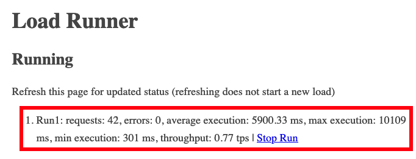
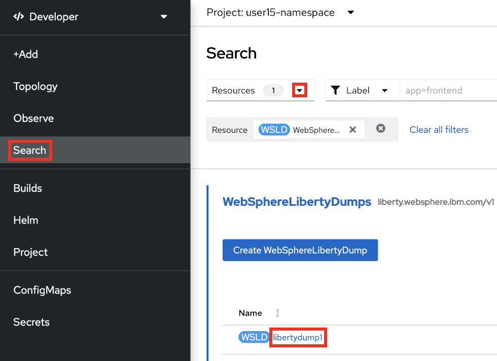
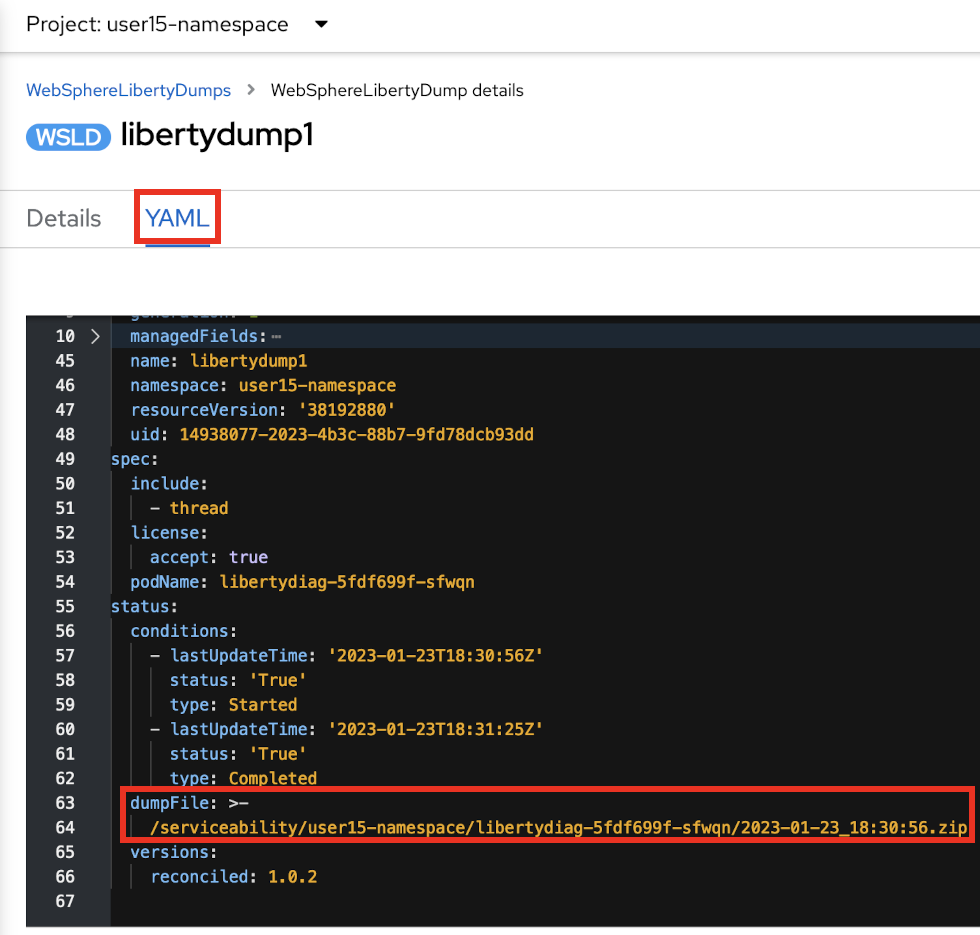
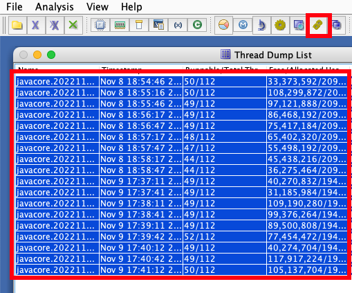
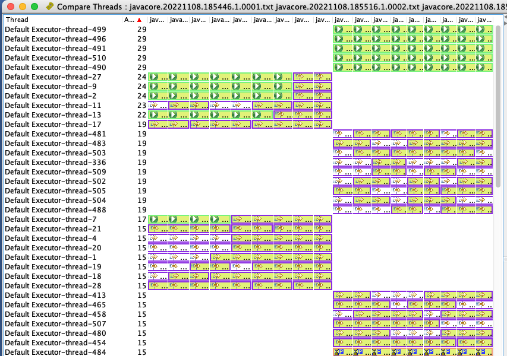

# Lab: High Response Times

This lab covers how to investigate high HTTP response times for a sample Liberty application in OpenShift.

## Theory

There are many ways to track and review HTTP response times for Liberty in an OpenShift environment:

1. Review response times exceeding a configured threshold using Liberty's [slow and hung request detection](https://openliberty.io/docs/latest/slow-hung-request-detection.html)
1. Manually gather thread dumps during the issue by opening a terminal in the container and executing `kill -3 $PID`
1. If the application is installed using the WebSphere Liberty Operator, the [WebSphereLibertyDump custom resource](https://www.ibm.com/docs/en/was-liberty/base?topic=resources-webspherelibertydump-custom-resource) may be used to gather a [Liberty server dump](https://openliberty.io/docs/latest/reference/command/server-dump.html) with a thread dump. This only works if the `WebSphereLibertyApplication` custom resource has the proper [`openliberty.io/day2operations` annotation](https://www.ibm.com/docs/en/was-liberty/base?topic=resources-webspherelibertydump-custom-resource), and if the container has a [`/serviceability` directory](https://www.ibm.com/docs/en/was-liberty/base?topic=operator-storage-serviceability).
1. If you have `cluster-admin` permissions, use the [MustGather: Performance, hang, or high CPU issues with WebSphere Application Server on Linux on Containers](https://www.ibm.com/support/pages/mustgather-performance-hang-or-high-cpu-issues-websphere-application-server-linux-containers) during the issue and search for repeating patterns in thread dumps
1. Review individual HTTP response times with Liberty's [HTTP access logging](https://openliberty.io/docs/latest/access-logging.html), although this will not discover stack traces driving slow response times
1. Review average and maximum response times with [Eclipse MicroProfile Metrics](https://openliberty.io/docs/latest/reference/feature/mpMetrics.html) in Liberty (or [in an OpenShift Service](https://docs.openshift.com/container-platform/latest/monitoring/managing-metrics.html)) integrated with [Prometheus and Grafana in OpenShift](https://www.ibm.com/docs/en/was-liberty/nd?topic=operator-monitoring-applications-red-hat-openshift) or [direct queries with a ServiceMonitor](https://docs.openshift.com/container-platform/latest/monitoring/querying-metrics.html), although these techniques will not discover stack traces driving slow response times
1. Review individual JAX-RS microservice response times with [Eclipse MicroProfile OpenTelemetry](https://www.ibm.com/docs/en/was-liberty/core?topic=environment-enabling-distributed-tracing) (formerly OpenTracing) with Jaeger or Zipkin, although this will not discover stack traces driving slow response times
1. Use third-party monitoring products such as [Instana](https://www.instana.com/supported-technologies/websphere-liberty/)

This lab will only cover some of the above methods.

## Labs

Choose one or more labs:

1. [Lab: Response times exceeding a configured threshold](#lab-response-times-exceeding-a-configured-threshold)
1. [Lab: Gather a Liberty server dump through the WebSphere Liberty Operator](#lab-gather-a-liberty-server-dump-through-the-websphere-liberty-operator)
1. [Lab: Use the performance/hang/high CPU MustGather on Linux on Containers](#lab-use-the-performancehanghigh-cpu-mustgather-on-linux-on-containers)
1. You could also gather thread dumps using `kill -3` as done in the [High CPU lab](lab_liberty_high_cpu.md#lab-manually-gather-thread-dumps-during-the-issue).

-----

## Lab: Response times exceeding a configured threshold

This lab will use Liberty's [slow and hung request detection](https://openliberty.io/docs/latest/slow-hung-request-detection.html) to print information about HTTP requests that exceed a configured threshold to logs.

This method is generally used when there are intermittent HTTP response time spikes. For example, if the average response time is 5 seconds but users are experiencing intermittent response time spikes of 10 seconds that are unacceptable, then the threshold may be set to 9 seconds to investigate the spikes.

This lab will demonstrate how to configure Liberty's [requestTiming feature](https://openliberty.io/docs/latest/reference/config/requestTiming.html), trigger it with an example application, and review the output.

The major downside to this approach is that the performance overhead of `requestTiming` is non-constant. The overhead is proportional to the volume and complexity of requests which should be determined in a performance test environment before configuring `requestTiming` in production. The main way to reduce the performance overhead is to increase the [`sampleRate`](https://openliberty.io/docs/latest/reference/config/requestTiming.html) although any value greater than `1` creates a chance of missing some slow requests.

In this lab, you will be using the `slowRequestThreshold` to trigger the details to the log. There is also a `hungRequestThreshold` that may be configured although it won't be covered in this lab. When `hungRequestThreshold` is breached, in addition to the same log message as with `slowRequestThreshold`, Liberty will take 3 thread dumps, one minute apart.

This lab will take approximately 10 minutes.

### Step 1: Install example application

If you haven't already, [install the sample application](lab_liberty_install_app.md). If you installed it in a previous lab, you may continue using the previous installation.

### Step 2: Configure requestTiming

Now that the application is installed and running, you will configure `requestTiming` to trigger if an HTTP request takes longer than 9 seconds. You will be modifying a running pod. In some real-world cases, this may be infeasible and the image will need to be re-built and re-deployed with the updated configuration.

<details markdown="1">
<summary>Using the command line</summary>

1. List the pods for the example application deployment; for example:

        oc get pods
   Example output:

        NAME                          READY   STATUS    RESTARTS   AGE
        libertydiag-b98748954-mgj64   1/1     Running   0          97s

1. Open a shell into the pod by replacing `$POD` with a pod name from the previous command:

        oc rsh -t $POD
   For example:

        oc rsh -t libertydiag-b98748954-mgj64

1. Copy and paste the following command and press `Enter`. Liberty will dynamically update the `requestTiming` configuration in the server (assuming the feature is installed, which it usually is).

```
echo '<?xml version="1.0" encoding="UTF-8"?><server><featureManager><feature>requestTiming-1.0</feature></featureManager><requestTiming slowRequestThreshold="9s" hungRequestThreshold="300s" sampleRate="1" /></server>' > /config/configDropins/overrides/requestTiming.xml
```

</details>

<details markdown="1">
<summary>Using the browser</summary>

1. In the `Topology` view of the [`Developer` perspective](openshift_perspective.md), click on the `libertydiag` circle, then click the `Resources` tab in the drawer on the right, and then click on the one pod that's running:  
   
1. Click on the `Terminal` tab to open a remote shell into the running container in the pod:  
   
1. Copy and paste the following command and press `Enter`. Liberty will dynamically update the `requestTiming` configuration in the server (assuming the feature is installed, which it usually is).

```
echo '<?xml version="1.0" encoding="UTF-8"?><server><featureManager><feature>requestTiming-1.0</feature></featureManager><requestTiming slowRequestThreshold="9s" hungRequestThreshold="300s" sampleRate="1" /></server>' > /config/configDropins/overrides/requestTiming.xml
```

</details>

### Step 3: Exercise long HTTP requests

Now that `requestTiming` is configured, you will simulate HTTP requests to Liberty and some of them will exceed 9 seconds. This will be done by executing 5 concurrent users that sleep a random amount of time with an average of 5 seconds and a standard deviation of 4 seconds. This means that approximately 68% of requests will be between 1-9 seconds, and the remaining will be either below 1 seconds or above 9 seconds, thus simulating a situation where most requests are fine but a minority exceed the defined threshold.

<details markdown="1">
<summary>Using the command line</summary>

1. Request the following web page from your terminal to exercise long requests:
    1. macOS, Linux, or Windows with Cygwin:

            curl -k -s "https://$(oc get route libertydiag "--output=jsonpath={.spec.host}")/servlet/LoadRunner?url=http%3A%2F%2Flocalhost%3A9080%2Fservlet%2FSleep%3Fmean%3D5000%26stddev%3D4000&method=get&entity=&concurrentusers=5&totalrequests=100&user=&password="

    1. Windows with Command Prompt:
        1. Ensure you have [`curl` for Windows](https://curl.se/windows/) installed
        1. List the application's URL:

                oc get route libertydiag "--output=jsonpath={.spec.host}{'\n'}"

        1. Execute the following command, replacing `$HOST` with the output of the previous command:

                curl -k -s "https://$HOST/servlet/LoadRunner?url=http%3A%2F%2Flocalhost%3A9080%2Fservlet%2FSleep%3Fmean%3D5000%26stddev%3D4000&method=get&entity=&concurrentusers=5&totalrequests=100&user=&password="

1. Request the following web page from your terminal to check on the status of the run:
    1. macOS, Linux, or Windows with Cygwin:

            curl -k -s "https://$(oc get route libertydiag "--output=jsonpath={.spec.host}")/loadrunner.jsp" | grep 'li>Run'

    1. Windows with Command Prompt:
        1. Ensure you have [`curl` for Windows](https://curl.se/windows/) installed
        1. List the application's URL:

                oc get route libertydiag "--output=jsonpath={.spec.host}{'\n'}"

        1. Execute the following command, replacing `$HOST` with the output of the previous command:

                curl -k -s "https://$HOST/loadrunner.jsp" | findstr 'li>Run'

1. Keep executing the above command until you see that the `max execution` value exceeds `9000`. This means at least one request took more than 9 seconds. (In the statistically rare chance that this doesn't happen, start again at step 1).

</details>

<details markdown="1">
<summary>Using the browser</summary>

1. Click on the `Load Runner` link from the libertydiag application homepage:  
   
1. In the `Target URL`, copy and paste the following:

        http://localhost:9080/servlet/Sleep?mean=5000&stddev=4000

1. Scroll to the bottom and click `Start`
1. You may refresh this page to check on the status of the run. Note that refreshing does not start a new run.  
   
1. Keep refreshing until you see that the `max execution` value exceeds `9000`. This means at least one request took more than 9 seconds. (In the statistically rare chance that this doesn't happen, `Start` the load again.)

</details>

### Step 4: Review data on long HTTP requests

Now you will review the logs to understand how to investigate slow HTTP requests.

<details markdown="1">
<summary>Using the command line</summary>

1. List the pods for the example application deployment; for example:

        oc get pods
   Example output:

        NAME                          READY   STATUS    RESTARTS   AGE
        libertydiag-b98748954-mgj64   1/1     Running   0          97s

1. Open a shell into the pod by replacing `$POD` with a pod name from the previous command:

        oc rsh -t $POD
   For example:

        oc rsh -t libertydiag-b98748954-mgj64

1. Copy and paste the following command and press `Enter`:

        cat /logs/messages.log

1. Scroll up until you find the `TRAS0112W` warning message signifying that an HTTP request exceeded the `requestTiming` configured threshold. For example:

        [11/1/22 20:02:12:053 UTC] 00000074 com.ibm.ws.request.timing.manager.SlowRequestManager         W TRAS0112W: Request AAPj5+4YXW3_AAAAAAAAAB5 has been running on thread 00000071 for at least 9000.263ms. The following stack trace shows what this thread is currently running.
        
              at java.lang.Thread.sleepImpl(Native Method)
              at java.lang.Thread.sleep(Thread.java:977)
              at java.lang.Thread.sleep(Thread.java:960)
              at com.example.servlet.Sleep.doSleep(Sleep.java:79)
              at com.example.servlet.Sleep.doWork(Sleep.java:40)
              at com.example.util.BaseServlet.service(BaseServlet.java:104)
              at jakarta.servlet.http.HttpServlet.service(HttpServlet.java:587)
              [...]
        
        The following table shows the events that have run during this request.
        
        Duration     Operation
        9001.583ms + websphere.servlet.service | libertydiag | com.example.servlet.Sleep?mean=5000&stddev=4000 

1. The warning message notes how long the request had been running at the time of the warning (`9000.263ms`) followed by a stack trace of what the thread was doing. The stack trace is the main symptom that suggests where the slow-down may be. In this example, the application (`com.example[...]`) is calling `Thread.sleep` which is causing the delay. Below the stack trace, Liberty prints a table showing any events leading up to the time the threshold was exceeded. In this case, the only event is the HTTP request itself which shows the servlet and its parameters. If the application performed other work such as database queries, these would be shown along with their SQLs.

</details>

<details markdown="1">
<summary>Using the browser</summary>

1. Open the `Terminal` for the application pod in the OpenShift web console as you did in [Step 2](#step-2-configure-requesttiming) above.
1. Copy and paste the following command and press `Enter`:

        cat /logs/messages.log

1. Scroll up until you find the `TRAS0112W` warning message signifying that an HTTP request exceeded the `requestTiming` configured threshold. For example:

        [11/1/22 20:02:12:053 UTC] 00000074 com.ibm.ws.request.timing.manager.SlowRequestManager         W TRAS0112W: Request AAPj5+4YXW3_AAAAAAAAAB5 has been running on thread 00000071 for at least 9000.263ms. The following stack trace shows what this thread is currently running.
        
              at java.lang.Thread.sleepImpl(Native Method)
              at java.lang.Thread.sleep(Thread.java:977)
              at java.lang.Thread.sleep(Thread.java:960)
              at com.example.servlet.Sleep.doSleep(Sleep.java:79)
              at com.example.servlet.Sleep.doWork(Sleep.java:40)
              at com.example.util.BaseServlet.service(BaseServlet.java:104)
              at jakarta.servlet.http.HttpServlet.service(HttpServlet.java:587)
              [...]
        
        The following table shows the events that have run during this request.
        
        Duration     Operation
        9001.583ms + websphere.servlet.service | libertydiag | com.example.servlet.Sleep?mean=5000&stddev=4000 

1. The warning message notes how long the request had been running at the time of the warning (`9000.263ms`) followed by a stack trace of what the thread was doing. The stack trace is the main symptom that suggests where the slow-down may be. In this example, the application (`com.example[...]`) is calling `Thread.sleep` which is causing the delay. Below the stack trace, Liberty prints a table showing any events leading up to the time the threshold was exceeded. In this case, the only event is the HTTP request itself which shows the servlet and its parameters. If the application performed other work such as database queries, these would be shown along with their SQLs.

</details>

### Step 5: Download Liberty logs

In many cases, you may want the full logs for review on your workstation.

<details markdown="1">
<summary>Using the command line</summary>

1. List the pods for the example application deployment; for example:

        oc get pods
   Example output:

        NAME                          READY   STATUS    RESTARTS   AGE
        libertydiag-ddf5f95b6-wj6dm   1/1     Running   0          97s

1. Download the Liberty `messages.log` by replacing `$POD` with a pod name from the previous command

        oc cp $POD:/logs/messages.log messages.log
   For example:

        oc cp libertydiag-ddf5f95b6-wj6dm:/logs/messages.log messages.log

</details>

<details markdown="1">
<summary>Using the browser</summary>

Files other than native logs (equivalent to Liberty's `console.log`) cannot be downloaded through the browser. You must use the command line steps above. Alternatively, you may use the `Terminal` tab of the pod and `cat` the file in the browser.

</details>

### Summary

In summary, this lab demonstrated how to configure Liberty's `requestTiming` to investigate HTTP requests that exceed a configured threshold. When this happens, Liberty prints a `TRAS0112W` warning to its logs with details about why the request may have been slow. When configuring `requestTiming`, it's advisable to use a monitoring tool to watch for this warning and send out alerts.

The main drawback of `requestTiming` is that it has a non-constant overhead so it's generally advisable to performance test `requestTiming` in an environment with simulated load that mimics production to gauge the likely overhead before putting it into production, or increasing `sampleRate` to reduce the overhead.

-----

## Lab: Gather a Liberty server dump through the WebSphere Liberty Operator

This lab will show how to gather a Liberty server dump through the WebSphere Liberty Operator during a high response time issue.

This lab will take approximately 10 minutes.

### Step 1: Install example application

If you haven't already, [install the sample application](lab_liberty_install_app.md) using the WebSphere Liberty operator. If you installed it in a previous lab, you may continue using the previous installation. If you previously installed the sample using a basic Kubernetes deployment, then [uninstall it](lab_liberty_uninstall_app.md) and [re-install](lab_liberty_install_app.md) using the WebSphere Liberty operator.

### Step 2: Exercise long HTTP requests

Now you will simulate HTTP requests to Liberty and some of them will be long. This will be done by executing 5 concurrent users that sleep a random amount of time with an average of 5 seconds and a standard deviation of 25 seconds. This means that approximately 68% of requests will be less than 30 seconds, and the remaining will be above 30 seconds, thus simulating long requests.

<details markdown="1">
<summary>Using the command line</summary>

1. Request the following web page from your terminal to exercise long requests:
    1. macOS, Linux, or Windows with Cygwin:

            curl -k -s "https://$(oc get route libertydiag "--output=jsonpath={.spec.host}")/servlet/LoadRunner?url=http%3A%2F%2Flocalhost%3A9080%2Fservlet%2FSleep%3Fmean%3D5000%26stddev%3D4000&method=get&entity=&concurrentusers=5&totalrequests=100&user=&password="

    1. Windows with Command Prompt:
        1. Ensure you have [`curl` for Windows](https://curl.se/windows/) installed
        1. List the application's URL:

                oc get route libertydiag "--output=jsonpath={.spec.host}{'\n'}"

        1. Execute the following command, replacing `$HOST` with the output of the previous command:

                curl -k -s "https://$HOST/servlet/LoadRunner?url=http%3A%2F%2Flocalhost%3A9080%2Fservlet%2FSleep%3Fmean%3D5000%26stddev%3D4000&method=get&entity=&concurrentusers=5&totalrequests=100&user=&password="

1. Request the following web page from your terminal to check on the status of the run:
    1. macOS, Linux, or Windows with Cygwin:

            curl -k -s "https://$(oc get route libertydiag "--output=jsonpath={.spec.host}")/loadrunner.jsp" | grep 'li>Run'

    1. Windows with Command Prompt:
        1. Ensure you have [`curl` for Windows](https://curl.se/windows/) installed
        1. List the application's URL:

                oc get route libertydiag "--output=jsonpath={.spec.host}{'\n'}"

        1. Execute the following command, replacing `$HOST` with the output of the previous command:

                curl -k -s "https://$HOST/loadrunner.jsp" | findstr 'li>Run'

</details>

<details markdown="1">
<summary>Using the browser</summary>

1. Click on the `Load Runner` link from the libertydiag application homepage:  
   
1. In the `Target URL`, copy and paste the following:

        http://localhost:9080/servlet/Sleep?mean=5000&stddev=25000

1. Scroll to the bottom and click `Start`

</details>

### Step 2: Request a Liberty server dump

You will gather a Liberty server dump using the [WebSphere Liberty Operator dump custom resource](https://www.ibm.com/docs/en/was-liberty/base?topic=resources-webspherelibertydump-custom-resource).

<details markdown="1">
<summary>Using the command line</summary>

1. List the pods for the example application deployment; for example:

        oc get pods
   Example output:

        NAME                          READY   STATUS    RESTARTS   AGE
        libertydiag-b98748954-mgj64   1/1     Running   0          97s

1. Create a `dump.yaml` file, replacing `$POD` with the name of the pod from the previous command (e.g. `libertydiag-b98748954-mgj64`):

        apiVersion: liberty.websphere.ibm.com/v1
        kind: WebSphereLibertyDump
        metadata:
          name: libertydump1
          annotations:
            day2operation.openliberty.io/targetKinds: Pod
        spec:
          license:
            accept: true
          podName: $POD
          include:
            - thread

1. Apply the YAML:

        oc apply -f dump.yaml

</details>

<details markdown="1">
<summary>Using the browser</summary>

1. Ensure the perspective is set to `Developer` in the top left:  
   
1. Set your current namespace/project to what you were provided. For example:  
   
1. In the `Topology` view of the [`Developer` perspective](openshift_perspective.md), click on the `libertydiag` circle, then click the `Resources` tab in the drawer on the right, and then copy the name of the pod that's running:  
   
1. Click `Operator Backed` on the `+Add` page:  
   
1. Click `WebSphereLibertyDump` and then click `Create`
1. Expand `License` and check `accept`
1. Paste the pod name from the step above into the `podName` text box.
1. Expand `include` and since we only want a thread dump, click `Remove include` for the second, `Value=heap` section
1. Click `Create`

</details>

### Step 3: Wait for the server dump to complete

Now that the server dump has been requested, you will check when the server dump has completed.

<details markdown="1">
<summary>Using the command line</summary>

1. Use the `wait` command to wait for the dump to complete:

        oc wait wldump libertydump1 --for condition=completed --timeout=5m
   Example output:

        webspherelibertydump.liberty.websphere.ibm.com/libertydump1 condition met

1. List `WebSphereLibertyDump` custom resources to get the final dump path:

        oc get wldump
   Example output:

        NAME           STARTED   COMPLETED   DUMP FILE
        libertydump1   True      True        /serviceability/user15-namespace/libertydiag-b98748954-mgj64/2023-01-23_18:30:56.zip

</details>

<details markdown="1">
<summary>Using the browser</summary>

1. Click on `Search`, click the `Resources` drop down, search for `dump`, check `WebSphereLibertyDump`, click on the resource name created earlier, and wait until there is a `Completed=True` line in the `Conditions` section at the bottom:  
   
1. Click on the `YAML` tab and scroll down to find the `dumpFile` location:  
   

</details>

### Step 4: Download the server dump

Download the server dump to your workstation.

<details markdown="1">
<summary>Using the command line</summary>

1. List the pods for the example application deployment; for example:

        oc get pods
   Example output:

        NAME                          READY   STATUS    RESTARTS   AGE
        libertydiag-ddf5f95b6-wj6dm   1/1     Running   0          97s

1. Download the dump by replacing `$POD` with a pod name from above and `$DUMP` with the dump path from the previous step.

        oc cp $POD:$DUMP dump.zip
   For example:

        oc cp libertydiag-ddf5f95b6-wj6dm:/serviceability/user15-namespace/libertydiag-ddf5f95b6-wj6dm/2023-01-23_18:30:56.zip dump.zip

1. Expand the zip file and you should find lots of diagnostics including a `javacore*.txt` file in the root of the zip which will show thread stacks at the time of the dump. This should include simulated high response time threads; for example:

        3XMTHREADINFO      "Default Executor-thread-1421" J9VMThread:0x00000000002BA800, omrthread_t:0x00007F8000006D50, java/lang/Thread:0x00000000FF943260, state:CW, prio=5
        3XMJAVALTHREAD            (java/lang/Thread getId:0x5D2, isDaemon:true)
        3XMJAVALTHRCCL            com/ibm/ws/classloading/internal/ThreadContextClassLoader(0x00000000E2169578)
        3XMTHREADINFO1            (native thread ID:0x71C, native priority:0x5, native policy:UNKNOWN, vmstate:CW, vm thread flags:0x00000481)
        3XMTHREADINFO2            (native stack address range from:0x00007F80424C1000, to:0x00007F8042501000, size:0x40000)
        3XMCPUTIME               CPU usage total: 0.015525339 secs, current category="Application"
        3XMHEAPALLOC             Heap bytes allocated since last GC cycle=0 (0x0)
        3XMTHREADINFO3           Java callstack:
        4XESTACKTRACE                at java/lang/Thread.sleepImpl(Native Method)
        4XESTACKTRACE                at java/lang/Thread.sleep(Thread.java:977)
        4XESTACKTRACE                at java/lang/Thread.sleep(Thread.java:960)
        4XESTACKTRACE                at com/example/servlet/Sleep.doSleep(Sleep.java:79) [...]

</details>

<details markdown="1">
<summary>Using the browser</summary>

Files other than native logs (equivalent to Liberty's `console.log`) cannot be downloaded through the browser. You must use the command line steps above.

</details>

### Step 5: Clean-up

Clean-up the server dump resource.

<details markdown="1">
<summary>Using the command line</summary>

1. Delete the `WebSphereLibertyDump` custom resource:

        oc delete wldump libertydump1

</details>

<details markdown="1">
<summary>Using the browser</summary>

1. Click on `Search`, click the `Resources` drop down, search for `dump`, check `WebSphereLibertyDump`, click the vertical ellipses next to the custom resource created earlier, click `Delete WebSphereLibertyDump`, and click `Delete`.

</details>

### Summary

In summary, this lab demonstrated how to gather a Liberty server dump for a WebSphere Liberty Operator-based application deployment during a simulated high response time issue.

-----

## Lab: Use the performance/hang/high CPU MustGather on Linux on Containers

This lab will use IBM Support's [MustGather: Performance, hang, or high CPU issues with WebSphere Application Server on Linux on Containers](https://www.ibm.com/support/pages/mustgather-performance-hang-or-high-cpu-issues-websphere-application-server-linux-containers) to gather thread dumps showing any HTTP requests being processed. Any statistical patterns in thread stacks may be used to infer potential causes of high HTTP response times. This MustGather is publicly available and nearly the same as the [standalone Linux performance/hang/high-CPU MustGather](https://www.ibm.com/support/pages/mustgather-performance-hang-or-high-cpu-issues-websphere-application-server-linux) in that it gathers CPU, memory, disk, network information, thread dumps, etc., and customers should be encouraged to use it if they can accept that it requires `cluster-admin` permissions to execute.

This lab will demonstrate how to execute the MustGather, download the diagnostics, and review them in the free [IBM Thread and Monitor Dump Analyzer (TMDA)](https://www.ibm.com/support/pages/ibm-thread-and-monitor-dump-analyzer-java-tmda) tool for potential causes of high HTTP response times.

**Note**: This lab requires that the user has `cluster-admin` permissions. A future version of the MustGather will not require administrator permissions.

This lab will take approximately 15 minutes.

### Step 0: Check if you have cluster-admin permissions

These steps will show if you have `cluster-admin` permissions. If you do not, you must skip this lab.

<details markdown="1">
<summary>Using the command line</summary>

1. Check if you have authority for all verbs on all resources:

        oc auth can-i '*' '*'
   Example output:

        yes

1. If the answer is `no`, then you do not have `cluster-admin` permissions.

</details>

<details markdown="1">
<summary>Using the browser</summary>

1. Access your OpenShift web console at `https://console-openshift-console.$CLUSTER/`. Replace `$CLUSTER` with your OpenShift cluster domain.
1. Ensure the perspective is set to `Administrator` in the top left:  
   
1. Expand `User Management`. If you don't see a `Users` option, then you do not have `cluster-admin` permissions. If you do see it, click on it, and then click on your user name:  
   
1. Click on `RoleBindings` and check if any binding has a `Role ref` of `cluster-admin`. If there are none, then you do not have `cluster-admin` permissions.  
   

</details>

### Step 1: Install example application

If you haven't already, [install the sample application](lab_liberty_install_app.md). If you installed it in a previous lab, you may continue using the previous installation.

### Step 2: Exercise long HTTP requests

Now you will simulate HTTP requests to Liberty and some of them will be long. This will be done by executing 5 concurrent users that sleep a random amount of time with an average of 5 seconds and a standard deviation of 25 seconds. This means that approximately 68% of requests will be less than 30 seconds, and the remaining will be above 30 seconds, thus simulating long requests.

<details markdown="1">
<summary>Using the command line</summary>

1. Request the following web page from your terminal to exercise long requests:
    1. macOS, Linux, or Windows with Cygwin:

            curl -k -s "https://$(oc get route libertydiag "--output=jsonpath={.spec.host}")/servlet/LoadRunner?url=http%3A%2F%2Flocalhost%3A9080%2Fservlet%2FSleep%3Fmean%3D5000%26stddev%3D25000&method=get&entity=&concurrentusers=5&totalrequests=100&user=&password="

    1. Windows with Command Prompt:
        1. Ensure you have [`curl` for Windows](https://curl.se/windows/) installed
        1. List the application's URL:

                oc get route libertydiag "--output=jsonpath={.spec.host}{'\n'}"

        1. Execute the following command, replacing `$HOST` with the output of the previous command:

                curl -k -s "https://$HOST/servlet/LoadRunner?url=http%3A%2F%2Flocalhost%3A9080%2Fservlet%2FSleep%3Fmean%3D5000%26stddev%3D25000&method=get&entity=&concurrentusers=5&totalrequests=100&user=&password="

1. Request the following web page from your terminal to check on the status of the run:
    1. macOS, Linux, or Windows with Cygwin:

            curl -k -s "https://$(oc get route libertydiag "--output=jsonpath={.spec.host}")/loadrunner.jsp" | grep 'li>Run'

    1. Windows with Command Prompt:
        1. Ensure you have [`curl` for Windows](https://curl.se/windows/) installed
        1. List the application's URL:

                oc get route libertydiag "--output=jsonpath={.spec.host}{'\n'}"

        1. Execute the following command, replacing `$HOST` with the output of the previous command:

                curl -k -s "https://$HOST/loadrunner.jsp" | findstr 'li>Run'

</details>

<details markdown="1">
<summary>Using the browser</summary>

1. Click on the `Load Runner` link from the libertydiag application homepage:  
   
1. In the `Target URL`, copy and paste the following:

        http://localhost:9080/servlet/Sleep?mean=5000&stddev=25000

1. Scroll to the bottom and click `Start`

</details>

### Step 3: Execute the MustGather

Now you will execute the MustGather. This takes approximately 6 minutes to run.

<details markdown="1">
<summary>Using the command line</summary>

1. Download a helper script:
    1. macOS or Linux: [containerdiag.sh](https://github.com/IBM/containerdiag/releases/download/0.1.20230301/containerdiag.sh)
    1. Windows: [containerdiag.bat](https://github.com/IBM/containerdiag/releases/download/0.1.20230301/containerdiag.bat)
1. Open a `Terminal` or `Command Prompt` and change directory to where you downloaded the script
1. On macOS or Linux, make the script executable:

        chmod +x containerdiag.sh

1. On macOS, remove the download quarantine:

        xattr -d com.apple.quarantine containerdiag.sh

1. List the current deployments:

        oc get deployments
   Example output:

        NAME          READY   UP-TO-DATE   AVAILABLE   AGE
        libertydiag   1/1     1            1           13m

1. Execute the MustGather. Normally, the `-c` option specifying the directory of the javacores is not needed; however, this sample application overrides the default javacore directory using `-Xdump`. This is common in container deployments so that a directory may be used that's mounted on a permanent disk so that diagnostics are still available if a pod is killed.
    1. macOS or Linux:

            ./containerdiag.sh -d libertydiag libertyperf.sh -c "/opt/ibm/wlp/output/defaultServer/logs/diagnostics/javacore*"

    1. Windows:

            containerdiag.bat -d libertydiag libertyperf.sh -c "/opt/ibm/wlp/output/defaultServer/logs/diagnostics/javacore*"
       
1. When the MustGather is complete, you will see a repeating message of the form:

        run.sh: Files are ready for download. Download with the following command in another window:
        
          oc cp [...]

1. Open another `Terminal` or `Command Prompt` and copy & paste the `oc cp` line that you saw in the previous step. For example (your command will be different):

        $ oc cp worker4-debug:/tmp/containerdiag.SN9RbwVmfC.tar.gz containerdiag.SN9RbwVmfC.tar.gz --namespace=openshift-debug-node-g8dqbdfx5d
        tar: Removing leading `/' from member names

1. Go back to the previous `Terminal` or `Command Prompt`, type `ok`, and press `Enter` to complete the MustGather:

        After the download is complete, type OK and press ENTER: ok
        [2022-11-08 19:01:03.670923238 UTC] run.sh: Processing finished. Deleting /tmp/containerdiag.SN9RbwVmfC.tar.gz
        [2022-11-08 19:01:03.674236286 UTC] run.sh: finished.

1. Expand the `containerdiag.*.tar.gz` file that you downloaded.

</details>

<details markdown="1">
<summary>Using the browser</summary>

The MustGather cannot be executed from the browser. You must use the command line steps above.

</details>

### Step 4: Analyze the thread dumps

If you are familiar with analyzing thread dumps, you may skip this step.

<details markdown="1">
<summary>Using the TMDA tool</summary>

1. Go to <https://www.ibm.com/support/pages/ibm-thread-and-monitor-dump-analyzer-java-tmda>
1. Download the JAR file
1. Double click to launch TMDA
1. Click File } Open Thread Dumps
1. Go to where you expanded `containerdiag.*.tar.gz` in the previous step } pods } libertydiag* } containers } libertydiag } Multi-select all javacore*.txt files and click Open
1. Multi-select all the thread dumps and click the Compare Threads button  
   
1. Expand the left pane of threads. The default sort is by average stack depth for a thread which tends to correlate with activity. Each row is a thread and each column is a thread dump.  
   
1. Click on a cell to show a thread stack on the right. Explore the various stacks and look for patterns. You should notice two distinct patterns:
    1. Stacks in `Thread.sleepImpl`. These are the simulated long-running requests.

            at java/lang/Thread.sleepImpl(Native Method)
            at java/lang/Thread.sleep(Thread.java:977)
            at java/lang/Thread.sleep(Thread.java:960)
            at com/example/servlet/Sleep.doSleep(Sleep.java:79) [...]

    1. Stacks in `SocketInputStream.socketRead0`. These are the load runner users.

            at java/net/SocketInputStream.socketRead0(Native Method)
            [...]
            at com/example/loadrunner/SimulatedUser.call(SimulatedUser.java:113) [...]

1. With a sufficient number of thread dumps and a persistent pattern of stack tops, this may be used to hypothesize likely causes of slow HTTP requests.

</details>

### Summary

In summary, this lab demonstrated how to execute the [performance/hang/high CPU MustGather on Linux on Containers](https://www.ibm.com/support/pages/mustgather-performance-hang-or-high-cpu-issues-websphere-application-server-linux-containers), download the diagnostics, and review them in the free [IBM Thread and Monitor Dump Analyzer (TMDA)](https://www.ibm.com/support/pages/ibm-thread-and-monitor-dump-analyzer-java-tmda) tool. With a sufficient number of thread dumps and a persistent pattern of stack tops during a time of slow HTTP requests, this data may be used to hypothesize likely causes of slow HTTP requests.
