# Install Sample WebSphere Liberty Application

You will install an example application called [libertydiag](https://github.com/IBM/libertydiag). Note that this link is just for reference as the application image will be pulled by OpenShift.

Choose to perform the installation either using the WebSphere Liberty Operator or a basic Kubernetes Deployment. If you're not sure, use the WebSphere Liberty Operator. The WebSphere Liberty Operator is essentially a wrapper around a basic Kubernetes Deployment with various [additional features and conveniences](https://www.ibm.com/docs/en/was-liberty/base?topic=operator-websphere-liberty-overview). Some of the labs require the use of the WebSphere Liberty Operator, so if you choose a basic Kubernetes Deployment, you will need to [uninstall](lab_liberty_uninstall_app.md) and recreate a WebSphere Liberty Operator deployment for those labs or skip them. We encourage you to test both the WebSphere Liberty Operator and basic Kubernetes Deployments as both are commonly used in the field.

Choose to use either the command line or the browser. In general, we suggest using the command line. Knowing how to do the same in the browser is optional.

You may use the same installation for all of the WebSphere Liberty labs, except where otherwise indicated at the beginning of a lab; however, if you decide to do so, some of the labs end with pods in a bad state and you will need to destroy them which will be mentioned in the cleanup steps of such labs.

If you previously installed this application and you would like to try a different method, then first [uninstall the sample application](lab_liberty_uninstall_app.md).

## Install using the WebSphere Liberty Operator

Using the command line

1. If you haven't already, [download the `oc` executable and log into your OpenShift console through the command line](openshift_login_commandline.md)
1. If you have been provided a namespace that you should use, then set your current namespace/project by replacing `$NAMESPACE` in the following command:

        oc config set-context --current --namespace $NAMESPACE

1. Create a file in your current directory named `libertydiag.yaml` and paste the following contents:

        apiVersion: liberty.websphere.ibm.com/v1
        kind: WebSphereLibertyApplication
        metadata:
          name: libertydiag
          annotations:
            openliberty.io/day2operations: WebSphereLibertyTrace,WebSphereLibertyDump
        spec:
          license:
            accept: true
            edition: IBM WebSphere Application Server
            metric: Virtual Processor Core (VPC)
            productEntitlementSource: Standalone
          applicationImage: quay.io/ibm/libertydiag
          probes:
            readiness:
              initialDelaySeconds: 1
              failureThreshold: 1
          manageTLS: true
          expose: true
          pullPolicy: Always

1. Deploy the YAML:

        oc apply -f libertydiag.yaml

1. Run the following command which will wait until the deployment is ready. This may take up to 2 minutes or more depending on available cluster resources and namespace limits:

        oc wait deployment libertydiag --for condition=available --timeout=5m

1. List the route's URL:

        oc get route libertydiag "--output=jsonpath={'https://'}{.spec.host}{'/\n'}"

1. Open the URL in your browser and accept the certificate warning
1. You should see the `libertydiag` application home page:  
   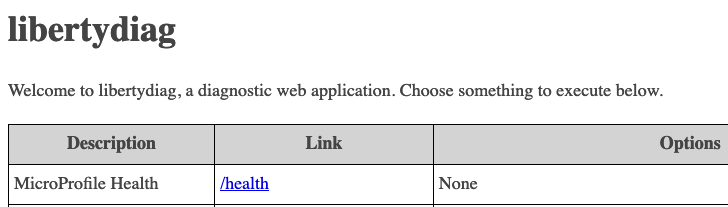
1. Go back to the previous page in the lab and continue to the next step of the lab

Using the browser

1. Access your OpenShift web console at `https://console-openshift-console.$CLUSTER/`. Replace `$CLUSTER` with your OpenShift cluster domain.
1. Ensure the perspective is set to `Developer` in the top left:  
   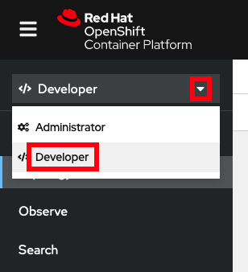
1. If you have been provided a namespace that you should use, then set your current namespace/project to what you were provided. For example:  
   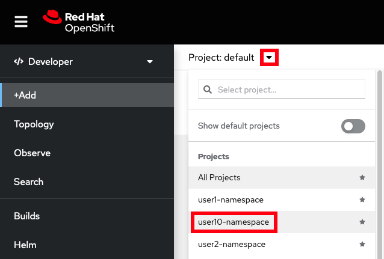
1. Click `Operator Backed` on the `+Add` page:  
   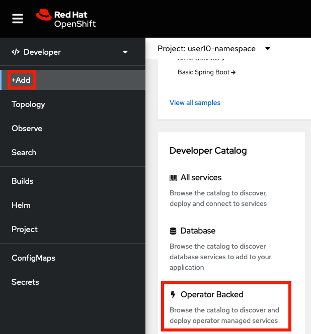
1. Click `WebSphereLibertyApplication`:  
   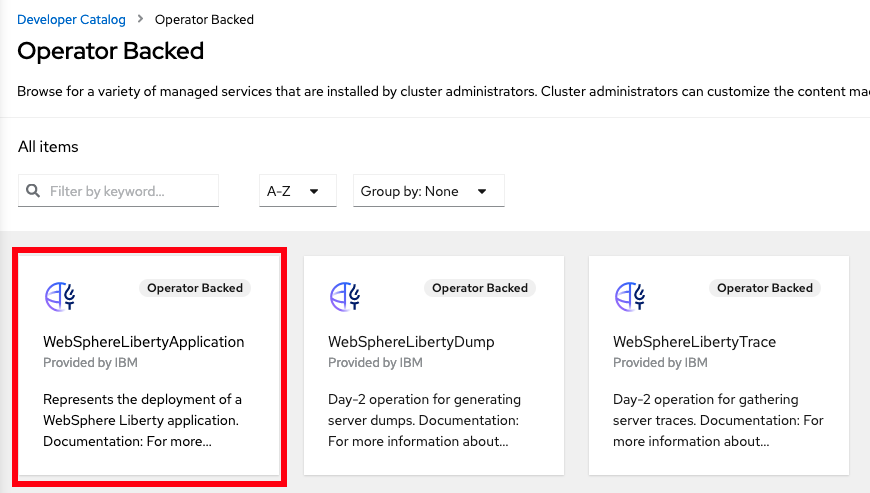
1. Click `Create`:  
   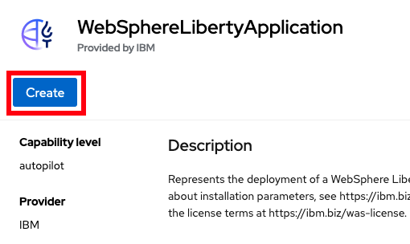
1. Scroll to the top and set the fields:
    1. `Name` = `libertydiag`
    1. `Application Image` = `quay.io/ibm/libertydiag`
    1. Click on `License` and check `accept`
    1. Change the `Expose` toggle to enabled
1. Expand `Probes` and click on `Readiness Probe`:  
   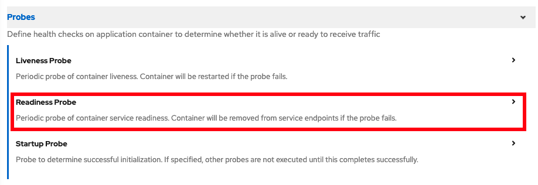
1. Set `initialDelaySeconds` to `1` and set `failureThreshold` to `1`:  
   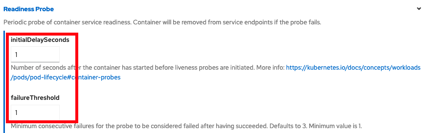
1. Scroll to the bottom and click `Create`
1. You will be taken back to the `Topology` view and you'll see the new application. While the application is initializing, there will be a light blue circle around it:  
   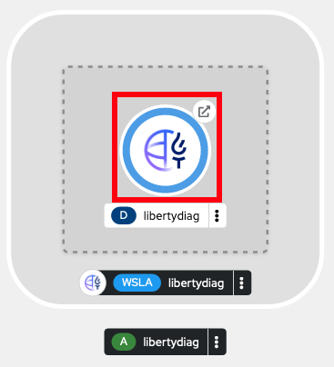
1. Wait until the circle turns into a dark blue, signifying the application is ready. This may take up to 2 minutes or more depending on available cluster resources and namespace limits:  
   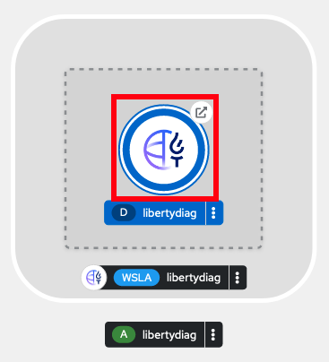
1. Click the `Open URL` button on the resulting `Topology` view to open the application (and accept the certificate warning)  
   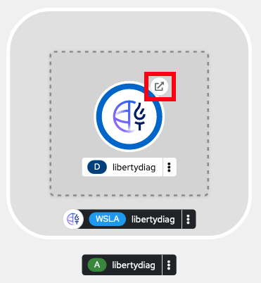
1. You should see the `libertydiag` application home page:  
   
1. Go back to the previous page in the lab and continue to the next step of the lab

## Install using a basic Kubernetes Deployment

Using the command line

1. If you haven't already, [download the `oc` executable and log into your OpenShift console through the command line](openshift_login_commandline.md)
1. If you have been provided a namespace that you should use, then set your current namespace/project by replacing `$NAMESPACE` in the following command with the namespace/project you were provided:

        oc config set-context --current --namespace $NAMESPACE

1. Create a file name `libertydiag.yaml` in the same directory where you are running the `oc` commands:

        apiVersion: apps/v1
        kind: Deployment
        metadata:
          name: libertydiag
          labels:
            app: libertydiag
        spec:
          selector:
            matchLabels:
              app: libertydiag
          template:
            metadata:
              labels:
                app: libertydiag
            spec:
              containers:
              - name: libertydiag
                image: quay.io/ibm/libertydiag
                imagePullPolicy: Always
                readinessProbe:
                  httpGet:
                    path: /health/ready
                    port: 9080
                    scheme: HTTP
                  initialDelaySeconds: 1
                  periodSeconds: 10
                  timeoutSeconds: 3
                  failureThreshold: 1

1. Create the deployment (a warning about `would violate PodSecurity` is expected in development clusters):

        oc apply -f libertydiag.yaml

1. Run the following command which will wait until the deployment is ready. This may take up to 2 minutes or more depending on available cluster resources and namespace limits:

        oc wait deployment libertydiag --for condition=available --timeout=5m

1. Create a service for the application to create a load balancer to the deployment:

        oc expose deployment libertydiag --port=80 --target-port=9080

1. Create a route for the application to expose the service externally:

        oc create route edge --service=libertydiag

1. List the route's URL:

        oc get route libertydiag "--output=jsonpath={'https://'}{.spec.host}{'/\n'}"

1. Open the URL in your browser and accept the certificate warning
1. You should see the `libertydiag` application home page:  
   
1. Go back to the previous page in the lab and continue to the next step of the lab

Using the browser

1. Access your OpenShift web console at `https://console-openshift-console.$CLUSTER/`. Replace `$CLUSTER` with your OpenShift cluster domain.
1. Ensure the perspective is set to `Developer` in the top left:  
   
1. If you have been provided a namespace that you should use, then set your current namespace/project to what you were provided. For example:  
   
1. Click `Container Images` on the `+Add` page:  
   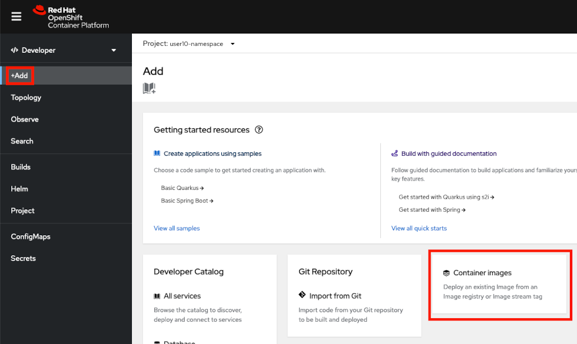
1. Set `Image name from external registry` to `quay.io/ibm/libertydiag`
1. Scroll down to the bottom and click on `Health checks`:  
   
1. Click on `Add Readiness probe`:  
   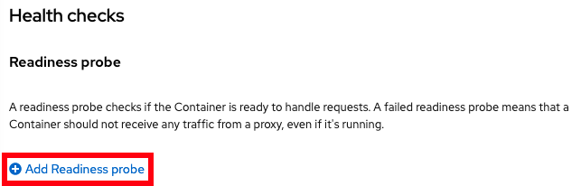
1. Fill in the following information (in particular, `Path` = `/health/ready` and `Port` = `9080`) **and** click the small checkbox in the bottom right:  
   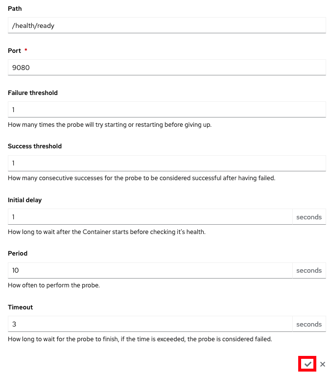
1. You should see `Readiness probe added`. Click on the `Create` button:  
   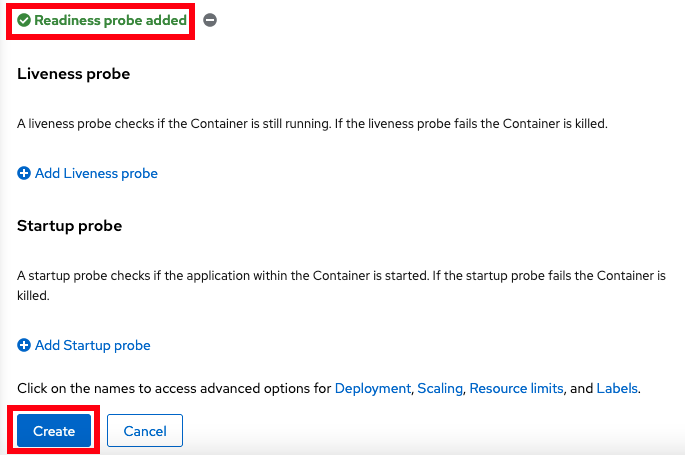
1. You will be taken back to the `Topology` view and you'll see the new application. While the application is initializing, there will be a light blue circle around it:  
   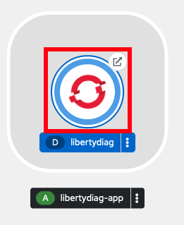
1. Wait until the circle turns into a dark blue, signifying the application is ready. This may take up to 2 minutes or more depending on available cluster resources and namespace limits:  
   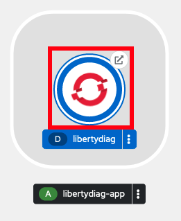
1. Click the `Open URL` button to open the application (and accept the certificate warning):  
   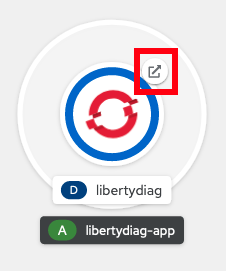
1. You should see the `libertydiag` application home page:  
   
1. Go back to the previous page in the lab and continue to the next step of the lab

## Learn More

* [WebSphere Liberty Operator](https://www.ibm.com/docs/en/was-liberty/base?topic=operator-websphere-liberty-overview)
* [Basic Kubernetes Deployments](https://kubernetes.io/docs/concepts/workloads/controllers/deployment/)
