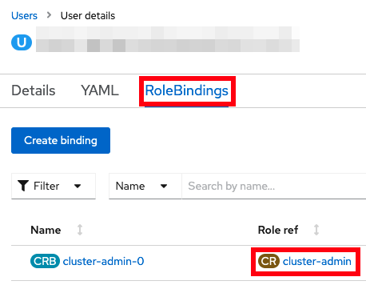

# Lab: Java OutOfMemoryErrors

This lab covers how to investigate Java OutOfMemoryErrors for a sample Liberty application in OpenShift.

## Theory

There are multiple ways to review a Java OutOfMemoryError (OOME) in an OpenShift environment:

1. Gather and review a heapdump (`*.phd`) produced by the OOME
1. Gather and review a system coredump (`*.dmp`) produced by the OOME

## Labs

Choose one or more labs:

1. [Lab: Gather and review a heapdump (`*.phd`) produced by the OOME](#lab-gather-and-review-a-heapdump-phd-produced-by-the-oome)
1. [Lab: Gather and review a system coredump (`*.dmp`) produced by the OOME](#lab-gather-and-review-a-system-coredump-dmp-produced-by-the-oome)

-----

## Lab: Gather and review a heapdump (`*.phd`) produced by the OOME

This lab will simulate a Java OutOfMemoryError and show how to download the resulting heapdump (`*.phd`) for analysis using the [Eclipse Memory Analyzer Tool](https://www.ibm.com/support/pages/eclipse-memory-analyzer-tool-dtfj-and-ibm-extensions).

This lab will take approximately 10 minutes.

### Step 1: Install example application

If you haven't already, [install the sample application](lab_liberty_install_app.md). If you installed it in a previous lab, you may continue using the previous installation.

### Step 2: Exercise a Java OutOfMemoryError

You will simulate a Java OutOfMemoryError by sending an HTTP request which allocates 1MB arrays until the Java heap is exhausted.

Using the command line

1. Request the following web page from your terminal to simulate an OutOfMemoryError:
    1. macOS, Linux, or Windows with Cygwin:

            curl -k -s "https://$(oc get route libertydiag "--output=jsonpath={.spec.host}")/servlet/AllocateObject?size=1048576&iterations=10000&waittime=10&retainData=false"

    1. Windows with Command Prompt:
        1. Ensure you have [`curl` for Windows](https://curl.se/windows/) installed
        1. List the application's URL:

                oc get route libertydiag "--output=jsonpath={.spec.host}{'\n'}"

        1. Execute the following command, replacing `$HOST` with the output of the previous command:

                curl -k -s "https://$HOST/servlet/AllocateObject?size=1048576&iterations=10000&waittime=10&retainData=false"
      

Using the browser

1. Craft the following link, replacing `$HOST` with the hostname of the application from the installation step above when you opened the `libertydiag` application in your browser (e.g. `libertydiag-user1-namespace.apps.was-education-cluster.example.com`):

        http://$HOST/servlet/AllocateObject?size=1048576&iterations=10000&waittime=10&retainData=false

1. Open this link in the browser

### Step 3: Confirm the OutOfMemoryError has occurred

When an OutOfMemoryError occurs, a message is written by the JVM into standard error (`stderr`). Standard error and standard output (`stdout`) are what are referred to in Kubernetes as the "logs" of a container. These logs are the "native" logs of the process and they are different than WebSphere logs. For WebSphere Liberty, the container logs are equivalent to `console.log` when running Liberty outside of containers. You may or may not find evidence of the OutOfMemoryError in WebSphere logs (e.g. `messages.log`) depending on whether the application handles the exception.

You will review the container logs to confirm that the OutOfMemoryError occurred.

Using the command line

1. List the pods for the example application deployment; for example:

        oc get pods
   Example output:

        NAME                          READY   STATUS    RESTARTS   AGE
        libertydiag-b98748954-mgj64   1/1     Running   0          97s

1. Print the native logs of the pod by replacing `$POD` with the pod name from the previous command:

        oc logs $POD
   For example:

        oc logs libertydiag-b98748954-mgj64

1. You should see OutOfMemoryError lines such as the following. If you don't see them, give it some time and print the logs again.

        JVMDUMP039I Processing dump event "systhrow", detail "java/lang/OutOfMemoryError" at 2022/12/07 16:43:38 - please wait.

Using the browser

1. In the `Topology` view of the [`Developer` perspective](openshift_perspective.md), click on the `libertydiag` circle, then click the `Resources` tab in the drawer on the right, and then click on `View logs` for the one pod that's running:  
   
1. You should see OutOfMemoryError lines such as the following. If you don't see them, give it some time by watching the bottom of the logs.  
   

### Step 4: Gather the heapdumps and javacores

Now you will gather the heapdumps and javacores produced by the OOME.

Using the command line

1. List the pods for the example application deployment; for example:

        oc get pods
   Example output:

        NAME                          READY   STATUS    RESTARTS   AGE
        libertydiag-b98748954-mgj64   1/1     Running   0          97s

1. Open a shell into the pod by replacing `$POD` with a pod name from the previous command:

        oc rsh -t $POD
   For example:

        oc rsh -t libertydiag-b98748954-mgj64

1. Note that the remote shell might timeout after a short period of inactivity, so be aware that you might have been logged out and you'll need to `oc rsh` back in to continue where you left off.
1. First, we need to find the process ID (PID) of Liberty. Most Liberty images do not have tools like `ps` or `top` pre-installed. However, most Liberty images only have a single process in the container which is the Java process running Liberty, and this has the PID of 1. Double check that this is the Liberty process by doing a full listing on PID 1:

        ls -l /proc/1/

1. If you see a Liberty current working directory (`cwd`) such as `/opt/ol/wlp` or `/opt/ibm/wlp` then you can assume that is the Liberty process. Otherwise, run `ls -l /proc/[0-9]*` and then explore each PID to find the Liberty process.

        ls -l /proc/1
   Example output:

        [...]
        lrwxrwxrwx.  1 1000830000 root 0 Dec  6 17:45 cwd -> /opt/ol/wlp/output/defaultServer
        -r--------.  1 1000830000 root 0 Dec  6 17:45 environ
        lrwxrwxrwx.  1 1000830000 root 0 Dec  6 14:57 exe -> /opt/ibm/java/jre/bin/java
        [...]

1. Normally, heapdumps for IBM Java and Semeru will be produced as `heapdump*phd` files in the `cwd` directory that you found above:

        ls -l /opt/ol/wlp/output/defaultServer/heapdump*phd
   However, in the case of this sample application, this directory is overridden with an `-Xdump` configuration. You can check JVM configurations by printing the process `cmdline` and `environ` files and find the relevant configuration. For example:

        cat /proc/1/cmdline /proc/1/environ
   Example output:

        [...] -Xdump:directory=logs/diagnostics/
   Therefore, for this application, heapdumps will go into `logs/diagnostics/` relative to `cwd`:

        ls /opt/ol/wlp/output/defaultServer/logs/diagnostics/heapdump*phd
   Example output:

        /opt/ol/wlp/output/defaultServer/logs/diagnostics/heapdump.20221207.172449.1.0002.phd
        /opt/ol/wlp/output/defaultServer/logs/diagnostics/heapdump.20221207.172502.1.0005.phd
        /opt/ol/wlp/output/defaultServer/logs/diagnostics/heapdump.20221207.172504.1.0008.phd
        /opt/ol/wlp/output/defaultServer/logs/diagnostics/heapdump.20221207.172504.1.0009.phd
   Note that overridding the `-Xdump` directory is common in container deployments so that a directory may be used that's mounted on a permanent disk so that diagnostics are still available if a pod is killed.

### Step 5: Download heapdumps

Using the command line

1. Download the heaps dumps by replacing `$POD` with a pod name from above and `$DIR` with the directory of the heapdumps. Note that `oc cp` does not support wildcards so the whole directory (or a single file) must be downloaded.

        oc cp $POD:$DIR .
   For example:

        oc cp libertydiag-ddf5f95b6-wj6dm:/opt/ol/wlp/output/defaultServer/logs/diagnostics .

Using the browser

Files other than native logs (equivalent to Liberty's `console.log`) cannot be downloaded through the browser. You must use the command line steps above.

### Step 6: Analyze the heap dumps

If you are familiar with analyzing heaps dumps, you may skip this step.

Review heap dumps

1. Go to <https://www.ibm.com/support/pages/eclipse-memory-analyzer-tool-dtfj-and-ibm-extensions>
1. Follow the instructions to download and launch MAT. These dumps are produced by IBM Java 8, so choose that download.
1. Click File } Open Heap Dump...
1. Open the first `phd` file that was downloaded.
1. In the `Getting Started Wizard`, choose `Leak Suspects Report` and click `Finish`
1. Review the leak suspects report which will highlight the cause of the OOME. For example:
   
    > The class com.example.servlet.AllocateObject occupies 426,783,880 (91.14%) bytes. The memory is accumulated in one instance of java.lang.Object[] which occupies 426,779,160 (91.14%) bytes.

### Summary

In summary, this lab demonstrated how to simulate a Java OutOfMemoryError, detect an OOME occurred in container logs, download the heapdump and javacore diagnostics, and review them in the Eclipse Memory Analyzer Tool.

-----

## Lab: Gather and review a system coredump (`*.dmp`) produced by the OOME

This lab will simulate a Java OutOfMemoryError and show how to download the resulting system coredump (`*.dmp`) for analysis using the [Eclipse Memory Analyzer Tool](https://www.ibm.com/support/pages/eclipse-memory-analyzer-tool-dtfj-and-ibm-extensions).

**Note**: This lab requires that the user has `cluster-admin` permissions to access the system coredump on the worker node.

This lab will take approximately 20 minutes.

### Step 0: Check if you have cluster-admin permissions

These steps will show if you have `cluster-admin` permissions. If you do not, you must skip this lab.

Using the command line

1. Check if you have authority for all verbs on all resources:

        oc auth can-i '*' '*'
   Example output:

        yes

1. If the answer is `no`, then you do not have `cluster-admin` permissions.

Using the browser

1. Access your OpenShift web console at `https://console-openshift-console.$CLUSTER/`. Replace `$CLUSTER` with your OpenShift cluster domain.
1. Ensure the perspective is set to `Administrator` in the top left:  
   
1. Expand `User Management`. If you don't see a `Users` option, then you do not have `cluster-admin` permissions. If you do see it, click on it, and then click on your user name:  
   
1. Click on `RoleBindings` and check if any binding has a `Role ref` of `cluster-admin`. If there are none, then you do not have `cluster-admin` permissions.  
   

### Step 1: Install example application

If you haven't already, [install the sample application](lab_liberty_install_app.md). If you installed it in a previous lab, you may continue using the previous installation.

### Step 2: Exercise a Java OutOfMemoryError

If you completed the previous lab above and generated an OOM already, skip down to [Step 4: Gather the system coredump](#step-4-gather-the-system-coredump).

Using the command line

1. Request the following web page from your terminal to simulate an OutOfMemoryError:
    1. macOS, Linux, or Windows with Cygwin:

            curl -k -s "https://$(oc get route libertydiag "--output=jsonpath={.spec.host}")/servlet/AllocateObject?size=1048576&iterations=10000&waittime=10&retainData=false"

    1. Windows with Command Prompt:
        1. Ensure you have [`curl` for Windows](https://curl.se/windows/) installed
        1. List the application's URL:

                oc get route libertydiag "--output=jsonpath={.spec.host}{'\n'}"

        1. Execute the following command, replacing `$HOST` with the output of the previous command:

                curl -k -s "https://$HOST/servlet/AllocateObject?size=1048576&iterations=10000&waittime=10&retainData=false"
      

Using the browser

1. Craft the following link, replacing `$HOST` with the hostname of the application from the installation step above when you opened the `libertydiag` application in your browser (e.g. `libertydiag-user1-namespace.apps.was-education-cluster.example.com`):

        http://$HOST/servlet/AllocateObject?size=1048576&iterations=10000&waittime=10&retainData=false

1. Open this link in the browser

### Step 3: Confirm the OutOfMemoryError has occurred

When an OutOfMemoryError occurs, a message is written by the JVM into standard error (`stderr`). Standard error and standard output (`stdout`) are what are referred to in Kubernetes as the "logs" of a container. These logs are the "native" logs of the process and they are different than WebSphere logs. For WebSphere Liberty, the container logs are equivalent to `console.log` when running Liberty outside of containers. You may or may not find evidence of the OutOfMemoryError in WebSphere logs (e.g. `messages.log`) depending on whether the application handles the exception.

You will review the container logs to confirm that the OutOfMemoryError occurred.

Using the command line

1. List the pods for the example application deployment; for example:

        oc get pods
   Example output:

        NAME                          READY   STATUS    RESTARTS   AGE
        libertydiag-b98748954-mgj64   1/1     Running   0          97s

1. Print the native logs of the pod by replacing `$POD` with the pod name from the previous command:

        oc logs $POD
   For example:

        oc logs libertydiag-b98748954-mgj64

1. You should see OutOfMemoryError lines such as the following. If you don't see them, give it some time and print the logs again.

        JVMDUMP039I Processing dump event "systhrow", detail "java/lang/OutOfMemoryError" at 2022/12/07 16:43:38 - please wait.

Using the browser

1. In the `Topology` view of the [`Developer` perspective](openshift_perspective.md), click on the `libertydiag` circle, then click the `Resources` tab in the drawer on the right, and then click on `View logs` for the one pod that's running:  
   
1. You should see OutOfMemoryError lines such as the following. If you don't see them, give it some time by watching the bottom of the logs.  
   

### Step 4: Gather the system coredump

Now you will gather the system coredump produced by the JVM. Unlike heapdumps and javacores, in many OpenShift environments, a system coredump is produced on the worker node rather than inside the container. Therefore, a user with `cluster-admin` authority must be used to download the coredump.

Using the command line

1. List the pods for the example application deployment; for example:

        oc get pods
   Example output:

        NAME                          READY   STATUS    RESTARTS   AGE
        libertydiag-b98748954-mgj64   1/1     Running   0          97s

1. Find the worker node of the pod by replacing `$POD` with the pod name from the previous command:

        oc get pod --output "jsonpath={.spec.nodeName}{'\n'}" $POD
   For example:

        oc get pod --output "jsonpath={.spec.nodeName}{'\n'}" libertydiag-b98748954-mgj64

1. Start a debug pod on that worker node by replacing `$NODE` with the node name from the previous command:

        oc debug node/$NODE -t
   For example:

        oc debug node/worker0.was-education-cluster.example.com -t

1. Note that the remote shell might timeout after a short period of inactivity, so be aware that you might have been logged out and you'll need to re-run `oc debug node` to continue where you left off.
1. These systems use `systemd-coredump` which places core dumps in `/var/lib/systemd/coredump/` (other systems may use [other locations](https://github.com/eclipse-openj9/openj9-docs/issues/1033)). To see them through the debug pod, prepend `/host`:

        sh-4.4# ls -l /host/var/lib/systemd/coredump/
        total 115824
        -rw-r-----+ 1 root root 118596950 Feb 28 16:25 'core.Default\x20Executo.1001210000.06a2f2e0997c46b2b50bdac3c25ab072.831941.1677601537000000.lz4'

1. Confirm the matching timestamp when the OutOfMemoryError occurred.
1. Now we'll use this debug pod to download the file. First start a looping output so that the debug pod doesn't timeout by executing:

        while true; do echo 'Sleeping'; sleep 8; done

1. Next, open a new terminal and find the debug pod and namespace. For example:

        oc get pods --field-selector=status.phase==Running --all-namespaces | grep debug
   Example output:

        openshift-debug-node-4whw7mhb8j  worker0was-education-clusterexamplecom-debug   1/1     Running   0     2m46s

1. Use the above namespace (first column) and pod name (second column) to download the core dump from the worker node. Unfortunately, there is an [open issue with escape characters](https://github.com/openshift/oc/issues/1358) so we must download the entire dumps directory:

        oc cp --namespace openshift-debug-node-4whw7mhb8j "worker0was-education-clusterexample.com-debug:/host/var/lib/systemd/coredump/" coredumps

1. Change directory into `coredumps` and any subdirectory that was created and then uncompress the core dump:
    1. Install the `lz4` utility:
        1. macOS:

                brew install lz4

        1. Windows: Download [lz4](https://github.com/lz4/lz4/releases/latest) (under Assets at the bottom)
        1. Linux: [Install](https://publib.boulder.ibm.com/httpserv/cookbook/Operating_Systems-Linux.html#Operating_Systems-Linux-Installing_Programs) the `lz4` program

    1. Decompress the file (replacing `$FILE` with the file name):

            lz4 -dc $FILE.lz4 > core.dmp

1. Go back to the previous terminal window and type `Ctrl^C` to stop the `while` loop, and then `exit` the debug node.

Using the browser

Files other than native logs (equivalent to Liberty's `console.log`) cannot be downloaded through the browser. You must use the command line steps above.

### Step 5: Analyze the system coredump

If you are familiar with analyzing system coredumps, you may skip this step.

Review core dump

1. Go to <https://www.ibm.com/support/pages/eclipse-memory-analyzer-tool-dtfj-and-ibm-extensions>
1. Follow the instructions to download and launch MAT. These dumps are produced by IBM Java 8, so choose that download.
1. Click File } Open Heap Dump...
1. Open the `*.dmp` file that was downloaded.
1. In the `Getting Started Wizard`, choose `Leak Suspects Report` and click `Finish`
1. Review the leak suspects report which will highlight the cause of the OOME. For example:
   
    > The class com.example.servlet.AllocateObject occupies 426,783,880 (91.14%) bytes. The memory is accumulated in one instance of java.lang.Object[] which occupies 426,779,160 (91.14%) bytes.

### Summary

In summary, this lab demonstrated how to simulate a Java OutOfMemoryError, detect an OOME occurred in container logs, download the system coredump diagnostic, and review it in the Eclipse Memory Analyzer Tool.
