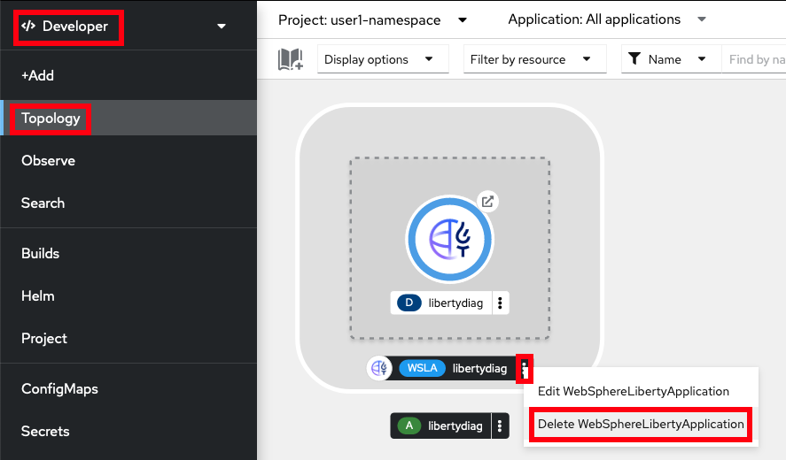
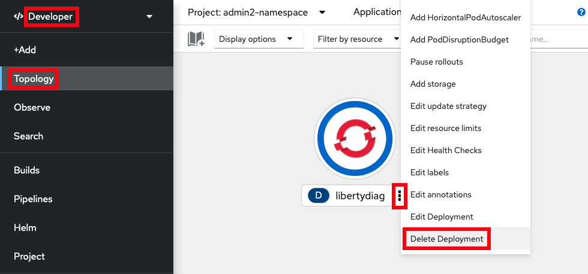

# Uninstall Sample WebSphere Liberty Application

You may uninstall the sample application either to clean up your environment or prepare to install it again using a different method.

Using the command line

1. If you created the application using the WebSphere Liberty Operator, then run:

        oc delete webspherelibertyapplication libertydiag

1. If you created the application using a basic Kubernetes Deployment, then run:

        oc delete deployment libertydiag

Using the browser

1. If you created the application using the WebSphere Liberty Operator, then go to the Developer } Topology view, click on the ellipses on the `WSLA` line and click `Delete WebSphereLibertyApplication` and then click `Delete`:  
   
1. If you created the application using a basic Kubernetes Deployment, then go to the Developer } Topology view, click on the ellipses on the `libertydiag` line and click `Delete Deployment` and then click `Delete`:  
   

---

If you need to re-install the application, go to the [install page](lab_liberty_install_app.md).
