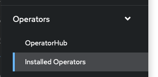
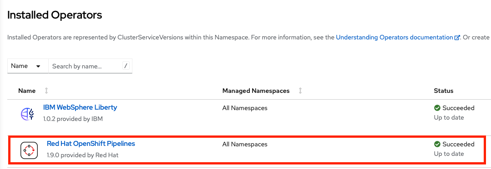
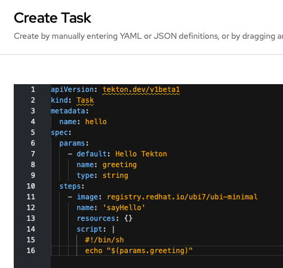
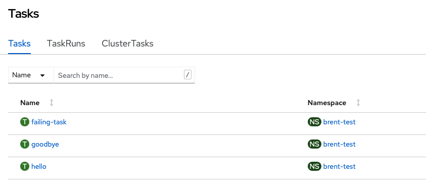

# OpenShift Pipelines

OpenShift pipelines is a continuous integration and delivery (CI/CD) solution based on the Tekton open source project. 

## Installing Openshift Pipelines

OpenShift Pipelines is provided as an add-on on top of OpenShift that can be installed via an operator available in the OpenShift OperatorHub.  

### Install the OpenShift Pipelines Operator from Operator Hub 

If the operator is not already available, it can be installed via OperatorHub. 

1. In the OpenShift Console, expand 'Operators' and select 'Installed Operators':  
   
1. Check that 'OpenShift Pipelines' is included in the list of installed operators:  
   
1. If the operator is not installed, click on OperatorHub.
1. In the search box, enter 'pipelines'
1. Click on 'RedHat OpenShift Pipelines'
1. Click the 'Install' button

## OpenShift Pipelines/Tekton concepts

Tekton defines a number of Kubernetes custom resources as building blocks in order to standardize pipeline concepts and provide a terminology that is consistent across CI/CD solutions. These custom resources are an extension of the Kubernetes API that let users create and interact with these objects using kubectl and other Kubernetes tools.

The custom resources needed to define a pipeline are listed below:

* Task: a reusable, loosely coupled number of steps that perform a specific task (e.g. building a container image)
* Pipeline: the definition of the pipeline and the Tasks that it should perform
* PipelineResource: inputs (e.g. git repository) and outputs (e.g. image registry) to and out of a pipeline or task
* TaskRun: the execution and result of running an instance of task
* PipelineRun: the execution and result of running an instance of pipeline, which includes a number of TaskRuns

In short, in order to create a pipeline, one does the following:

* Create custom Tasks
* Create a Pipeline and PipelineResources to define application delivery pipeline
* Create a PipelineRun to instantiate and invoke the pipeline

## Creating a simple pipeline

In this lab, we will create a simple pipeline to explore Tekton concepts. A pipeline would normally contain tasks to gather code from a source repository, build it, containerize it, and push it to the container registry. In this case, we will only create tasks that produce logs. 

### Create some tasks

For each task you have the option of creating it manually in the OpenShift console or using the command line to apply an existing yaml file. To create a task manually, expand 'Pipelines' in the OpenShift console and click on 'Tasks'. In the upper right hand corner, click 'Create' and select 'Task'. Edit the yaml for the task to match the values in the provided files, or experiment with different values. The tasks do not have to exactly match the provided tasks for the purposes of this lab. 

1. Create a task named 'hello' that will echo a parameter value to the logs. If using the command line, download the file [`hello.yaml`](lab_pipelines_assets/hello.yaml) and run `oc apply -f hello.yaml`. If using the console, enter the contents of `hello.yaml` into the `Create Task` editor.  
   
1. Create a task named 'goobye' that will echo 'Goodbye' to the logs. If using the command line, download the file file [`goodbye.yaml`](lab_pipelines_assets/goodbye.yaml) and run `oc apply -f goodbye.yaml`. If using the console, enter the contents of `goodbye.yaml` into the `Create Task` editor.
1. Create a task named 'failing-task' that will always fail. Again, either download the file [`fail.yaml`](lab_pipelines_assets/fail.yaml) and run `oc apply -f fail.yaml` or enter the contents into the console's `Create Task` editor. 
1. In the OpenShift console, expand 'Pipelines' and select 'Tasks'. You should see the three tasks you created. Click on each one and examine the yaml definition.  
   
1. If using the command line, run `oc get task` to view the created tasks. 

        labs % oc get task 
        NAME           AGE
        failing-task   53s
        goodbye        109s
        hello          3m4s

### Create a pipeline

For this part of the lab we will use the OpenShift console to create a pipeline consisting of the tasks we just created. 

1. In the console, expand 'Pipelines' and click on 'Pipelines'.
1. In the upper right hand corner, click on 'Create' and select 'Pipeline'
1. You should now see the 'Pipeline Builder' view which we will use to create a new pipeline. Enter a name for the pipeline such as 'lab-pipeline'.
1. In the 'Tasks' section, click on 'Add Task'. In the search box, enter 'hello'. As you are typing, notice that there are many other predefined tasks that are also available. When you find the 'hello' task, click the 'Add' button to add it to the pipeline. 
1. The 'hello' task is now in the pipeline. Hover over the task in the builder and notice that there is a '+' symbol at the left, right, and bottom of the task bubble. We want to have our next task run after the 'hello' task, so click the '+' to the right of the bubble. 
1. A new 'Add Task' bubble is now available to the right of the 'hello' bubble. Click on it and add the 'goodbye' task. 
1. Click 'Create' to create the pipeline

### Running the pipeline

1. After clicking 'Create' you are shown an overview of the pipeline. You can click on 'yaml' to examine the details of the pipeline that was created. 
1. Run the pipeline by clicking on 'Actions' in the upper right hand corner and selecting 'Start'. You can see the progress of the pipeline run in the 'PipelineRun details' section of the resulting screen. After a short amount of time, both 'hello' and 'goodbye' should have green check marks indicating that they have finished. 
1. Click on 'logs' and click on either 'Hello' or 'Goodbye'. You should see the output for the task you created. 
1. Navigate back to the list of pipelines (Pipelines->Pipelines in the console). You should now see a green bar next to your pipeline indicating that the run was succesful. 

### Editing the pipeline

1. Navigate to the details page for the pipeline by clicking on it. Select Actions->Edit Pipeline. This will bring you back tot he pipeline builder screen. 
1. Add a new task between the 'Hello' and 'Goobye' tasks by clicking the '+' symbol either to the right of 'Hello' or to the left of 'Goodbye'. Click on the resulting 'Add Task' bubble and add a task for 'failing-task'. 
1. There should be a red exclamation mark on the newly created task. Hover over it to see what the problem is. 
1. Before we can save the new pipeline, we have to provide parameters for the 'failing-task' task. Click on the task bubble and a details panel will appear to the right of the screen. In the 'Parameters' section, enter a value for 'appName'. The red exclamation mark should go away, and saving the pipeline is now enabled. 
1. Save the pipeline by clicking the 'Save' button. 

### Rerunning the pipeline

1. Start a new run by selecting Actions->Start. This time, the pipeline details should show a green check mark for 'Hello', and a red exclamation mark for 'failing-task'. The 'Goodbye' task does not run. 
1. Click on the 'Events' tab. It should show that 'failing-task' exited with exit code 2, and that the Pipeline Run had one failed task and one skipped task. 
1. Navigate back to the list of Pipelines. You should now have a green, red, and gray bar next to the pipeline that shows the completed, failed, and skipped tasks in the pipeline. 

### Adding 'finally' tasks

1. Now edit the pipeline again. This time, add several 'Finally' tasks by clicking on the '+' next to 'Add finally task'. Repeat the procedure a few times, adding the hello and goodbye tasks. Notice that all of the tasks run in parallel. 
1. Save the pipeline and run it again. Notice that the 'Goodbye' task still doesn't run, but all of the 'Finally' tasks you added are executed. Note that the 'Finally' tasks may appear to run sequentially in the order they are defined because there aren't enough system resources to handle them at once, but they are actually run in parallel. 

## Install Tekton dashboard

The Tekton dashboard provides a more detailed overview of OpenShift pipelines than the OpenShift console. Use the following steps to install the dashboard:

1. Run `curl -L -O https://github.com/tektoncd/dashboard/releases/download/v0.32.0/release-full.yaml` from a terminal. If you're working on a system that doesn't have curl installed, just download the file using a browser. 
1. The downloaded yaml file uses the namespace `tekton-pipelines` by default, but we need to install it in `openshift-pipelines`. To fix this, replace all instances of `tekton-pipelines` in `release-full.yaml` with `openshift-pipelines` (linux command: `sed -i 's/tekton-pipelines/openshift-pipelines/g' release-full.yaml` mac command: `sed -i.bak 's/tekton-pipelines/openshift-pipelines/g' release-full.yaml`)
1. Run `oc apply -f release-full.yaml`
1. Run `oc get pods -n openshift-pipelines`. The dashboard will be installed when all pods are in 'Running' state. 
1. Run `oc expose svc/tekton-dashboard -n openshift-pipelines` to create a route to the dashboard
1. Run `oc get route tekton-dashboard -n openshift-pipelines` to get the URL for the dashboard

# Learn More

* [OpenShift Pipelines Tutorial](https://github.com/openshift/pipelines-tutorial#deploy-sample-application)
* [Knative Deployment using Tekton Pipelines](https://github.com/IBM/tekton-tutorial)
