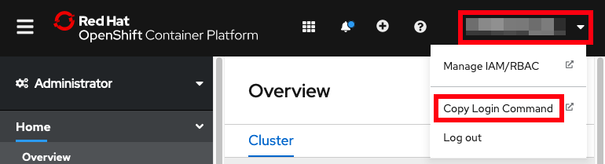

# Accessing OpenShift through the command line

1. Download the OpenShift terminal client (`oc` executable) to your workstation. **Note:** Some commands require a recent version of `oc` so re-download if you have an old version.
    1. [Windows](https://mirror.openshift.com/pub/openshift-v4/x86_64/clients/ocp/stable/openshift-client-windows.zip)
    1. [Linux](https://mirror.openshift.com/pub/openshift-v4/x86_64/clients/ocp/stable/openshift-client-linux.tar.gz)
    1. [macOS on Intel](https://mirror.openshift.com/pub/openshift-v4/x86_64/clients/ocp/stable/openshift-client-mac.tar.gz)
        * On macOS, you may need to remove the download quarantine before extracting the file. Open `Terminal`, change directory to where you downloaded the file and run:

                xattr -d com.apple.quarantine openshift*

    1. [macOS on ARM/AArch](https://mirror.openshift.com/pub/openshift-v4/x86_64/clients/ocp/stable/openshift-client-mac-arm64.tar.gz)
        * On macOS, you may need to remove the download quarantine before extracting the file. Open `Terminal`, change directory to where you downloaded the file and run:
 
                xattr -d com.apple.quarantine openshift*
 

1. Unzip/extract the `openshift-client-*` download into some directory
1. Open a `Terminal` or `Command Prompt` application and change directory to where you expanded the `openshift-client-*` download
1. Add this directory to your `PATH` by replacing `$OCDIR` with this directory:
    1. macOS/Linux:

            export PATH=$OCDIR:$PATH
        For example:

            export PATH=${HOME}/Downloads/openshift-client-mac/:$PATH

    1. Windows Command Prompt:

            set PATH=$OCDIR;%PATH%
        For example:

            set PATH=%HOMEPATH%\Downloads\openshift-client-windows\;%PATH%

    1. Windows Cygwin terminal:

            export PATH=$OCDIR:$PATH
        For example:

            export PATH=${HOMEPATH}/Downloads/openshift-client-windows/:$PATH

1. Open your browser to the OpenShift web console at <https://console-openshift-console.$CLUSTER_DOMAIN_NAME/>
1. In the top right, click on your name } Copy Login Command } Log-in again } Display Token } Copy the `oc login` command  
   
1. Paste and run the `oc login` command in the `Terminal` or `Command Prompt` opened in step 3 above.
    1. See the [Frequently Asked Questions (FAQ)](faq.md) for common login errors.
1. Run `oc whoami` to confirm everything works.
1. If you have been provided a namespace that you should use, then set your current namespace, replacing `$NAMESPACE` in the following command:

        oc config set-context --current --namespace $NAMESPACE
